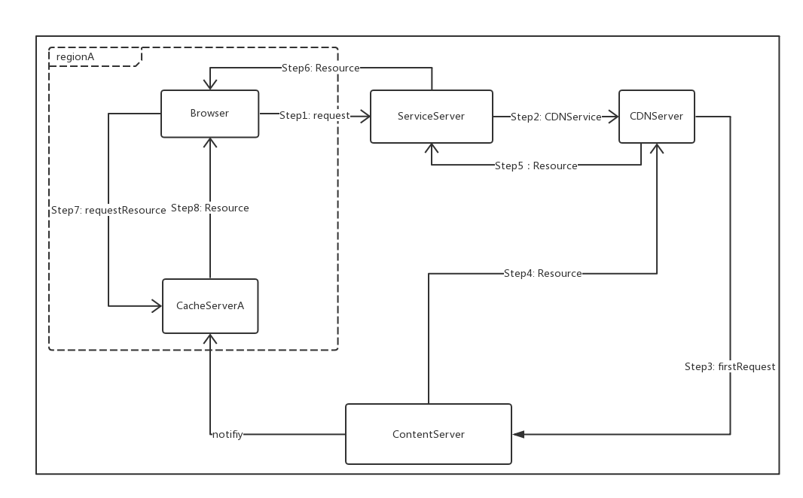
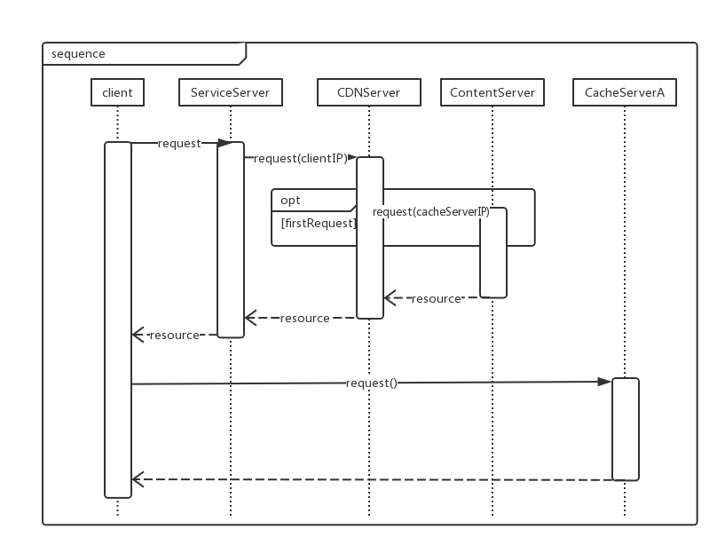
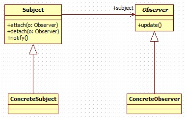
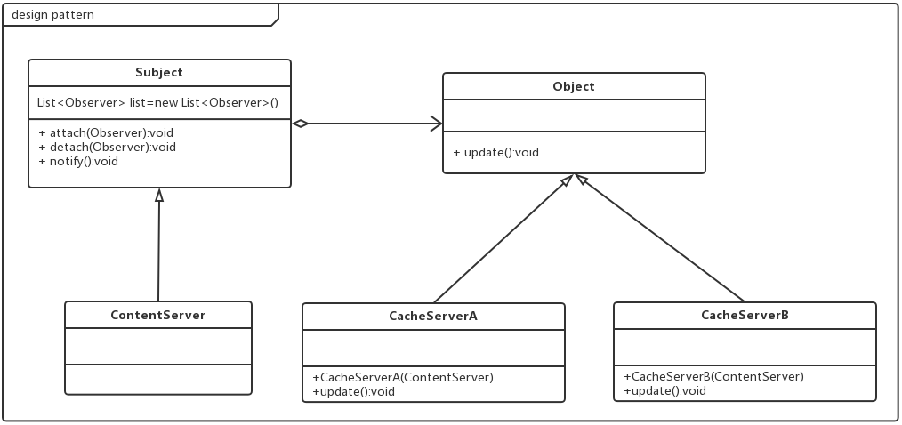

# CDNService 模块

## 一、概述

### 承担的需求（主要秘密）

为了能够满足高峰期时间（例如节假日），要允许5百万用户同时在线使用的质量属性，本系统使用CDNService，CDN服务，用来分摊静态资源流量，加快访问速度。CDN全称Content Delivery Network，即内容分发网络。旨在将网站的静态内容发布到最接近用户的网络的边缘，使用户可以就近取得所需的内容，提高用户访问网站的响应速度。

### 可能会修改的实现（次要秘密）
* 自定义DNS负载均衡系统需要对用户请求的域名进行解析，并且根据实际情况，把对用户响应速度最快的IP节点（缓存服务器的地址）返回给用户。计算响应速度最快的IP节点的方法可能会有变更
* 关于缓存服务器与源服务器保持数据一致性的方式可能会存在变更。

### 涉及的相关质量属性

* R2 服务可靠性
* R4 更新数据时系统可用
* R9 保证存取效率
* R10 高峰吞吐量

### 角色
服务提供者

### 模块对外接口
支持通过HTTP接口直接访问，访问方式如下
* 服务URL：源服务器地址/dns_resolve 
* 请求方法：POST
* 支持参数： client_ip=x.x.x.x 

### 流程图

## 二、类的设计

### 2.1 类图

### 2.2 类描述

#### xxx类

##### 类职责
##### 类方法
---

## 三、重要协作

### 顺序图

---

#### 协作描述
1.	用户向源服务器发出请求
2.	源服务器向CDN服务器发出请求，并且将客户端IP地址作为参数
3. 	DNS首先判断用户是否首次访问，如果首次访问，需要判断其最近的缓存服务器地址，并且向ContentServer请求资源（比如html文件）
4. 	ContentServer返回资源（比如html文件里面的资源地址全部改成其最近的缓存服务器地址）给CDN服务器，CDN服务器会缓存内容。
5.	将结果发给源服务器 
6.	源服务器将资源返回给客户端
7. 	客户端加载其他资源（比如html依赖的js文件），会向最近的缓存服务器发起请求
8.  缓存服务器返回资源

---

## 四、设计模式应用

### 观察者模式

观察者模式（又被称为发布-订阅（Publish/Subscribe）模式，属于行为型模式的一种，它定义了一种一对多的依赖关系，让多个观察者对象同时监听某一个主题对象。这个主题对象在状态变化时，会通知所有的观察者对象，使他们能够自动更新自己。

#### 使用场景：

资源服务器ContentServer与缓存服务器CacheServer之间需要维持数据一致性。而且可能存在很多台缓存服务器。

#### 效果：
* 通过观察者模式，当资源服务器发生变化时，会通知所有缓存服务器，使得CDN缓存得到刷新。
* 耦合的双方都依赖于抽象，而不是依赖具体。从而使得各自的变化都不会影响另一边的变化。可扩展性良好。

