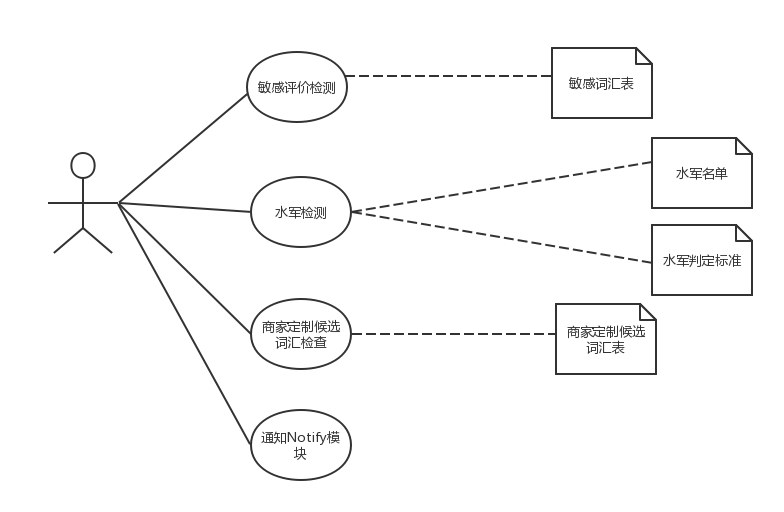
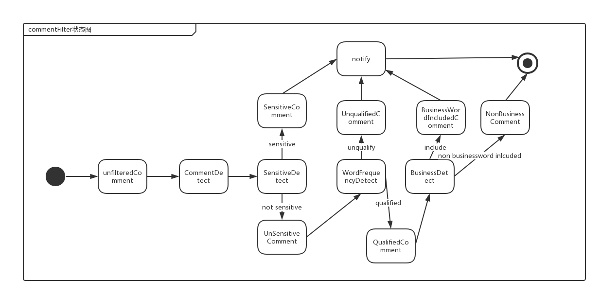

# CommentFilter 模块 #

## 一、概述 ##
### 承担的需求（主要秘密） ###
评论处理功能需求包括发布评论、评论管理、敏感词处理、水军检测、商家定制候选词汇检查。功能关联模块包含CommentFilter模块，该模块接收由CommentpPipe传递过来的评论信息（Comment），过滤后将评论信息返回给pipe并启用通知模块（CommentNotifier）让其通知商家或管理员。
模块CommentFilter与CommentPipe共同完成评论过滤、通知Notifier进行通知操作等功能，在CommentFilter模块详细设计文档主要讨论CommentFilter承担的主要职责：敏感评价处理、水军检测、商家定制候选词汇检查。关于
评论发布、评论管理、具体通知操作这些与CommentFilter有关联但是并非本模块实现的职责在此不作详细讨论。
CommentFilter承担的主要职责：敏感评价处理、水军检测、商家定制候选词汇检查。

1.敏感评价处理
CommentFilter内含SensitiveFilter和BusinessFilter过滤器子类，分别为敏感词过滤器和商家定制候选词过滤器。CommentFilter接收来pipe的评论信息，SensitiveFilter过滤器进行对敏感词的过滤，即查看是否带有敏感词汇，如果有敏感词汇，则返回pipe一个SensitiveComment类型（定义的敏感评论数据结构，内部记录发布敏感评论的用户信息及评论敏感内容）的评论，并且通过PC连接件通知CommentNotify模块使其通知管理员，如果没有敏感词汇，则把评论返回给pipe。

2.水军检测
CommentFilter含WordFrequencyFilter过滤器子类。当评价被判定为敏感评价之后，系统进行水军检测以判断该用户是否为水军，即用WordFrequencyFilter根据特定词汇和句式出现大于10次，过滤水军评论。 若判定为水军，则将该用户加入水军列表，同时通过PC连接件通知CommentNotify模块使其通知管理员

3.商家定制候选词汇处理 如果没有敏感词汇，则把评论返回给pipe，然后pipe再次用BusinessFilter进行检测是否带有商家定制候选词汇，如果有则通过PC连接件通知相关商家，最后返回Comment给pipe。

### 用例图设计 ###

### 可能会修改的实现（次要秘密） ###
1. 水军判定标准的可扩展性（目前是特定词汇特定句式出现十次以上）
2. 敏感评价处理方式的可扩展性（目前是查找敏感词汇表中是否有词汇出现在评论中） 
3. 候选词汇、敏感词汇的扩展
4. 通知策略的变化（现在是发现敏感评论或候选词汇则传递给pc连接件启用Notify模块进行对管理员或商家通知）

### 涉及的相关质量属性

**R13 敏感词汇检测并通知**

C25: 系统可以检测评论中的敏感词汇,通知管理员审核.

C26: 可以运行时修改敏感词汇表

**R14 水军检测**

C27: 对于输入敏感词的用户,检测其是否为水军.如果是则通知管理员

**R15 通知商家**

C28: 出现商家指定词汇时,通知商家.

**R16 通知规则的可拓展性**

C29: 允许添加新的通知规则,添加要在15人/月内完成

C30: 增加新的条件不能影响搜索业务的运行

注：具体通知操作为Notify模块职责，CommentFilter模块中不作为重点讨论。
### 模块对外接口

**供接口**

FilterResult doFilter(List<Comment> commentList)

**需接口**

CommentNotifyService.notify(User receiver,Message message)

## 二、类的设计 ##

### 2.1 类图 ###

### 2.2 类描述 ###
#### CommentFilter类

##### 类职责

本类为评论过滤器接口

##### 类方法

* List`<`Comment`>` doFilter\(List`<`Comment`>`\): 
  * 职责：定义过滤器接口
  * 前置条件：无
  * 后置条件：无

---
#### SensitiveFilter类

##### 类职责

进行敏感词检测及过滤

##### 类方法

* List`<`Comment`>` doFilter\(List`<`Comment`>`\): 
  * 职责：定义接口
  * 前置条件：管道中有待检测敏感词汇的评论
  * 后置条件：无

---

#### Decorator类

##### 类职责

装饰者模式中的装饰者，含敏感词汇检测后需要进行检测过滤的子类

##### 类方法

* Decorator（CommentFilter）

  * 职责：构造函数
  * 前置条件：CommentFilter实例被创建
  * 后置条件：私有成员CommentFilter指向SensitiveFilter实例

* List`<`Comment`>` doFilter\(List`<`Comment`>`\):

  * 职责：根据装饰者过滤器的过滤条件进行评论过滤
  * 前置条件：管道中有需过滤的评论信息；
  * 后置条件：评论按照过滤器过滤条件过滤完毕

---

#### BusinessFilter类

##### 类职责

对评论列表中的评论进行商家指定候选词汇的过滤

##### 类方法

* BusinessFilter（CommentFilter）

  * 职责：构造函数
  * 前置条件：CommentFilter实例被创建
  * 后置条件：Decorator被初始化

* List`<`Comment`>` doFilter\(List`<`Comment`>`\):

  * 职责：判断评论中是否有商家制定词汇，进行过滤
  * 前置条件：管道中有需过滤的评论；
  * 后置条件：含商家制定词汇的评论被过滤出来

---

#### WordFrequencyFilter类

##### 类职责

水军检测。检测评论中特定词汇特定句式是否超过可被认为为水军的标准，并对评论进行过滤。

##### 类方法

* WordFrequencyFilter（CommentFilter）

  * 职责：构造函数
  * 前置条件：CommentFilter实例被创建
  * 后置条件：Decorator被初始化

* List`<`Comment`>` doFilter\(List`<`Comment`>`\):

  * 职责：根据水军检测规则进行过滤，即检测评论中特定词汇特定句式是否超过可被认为为水军的标准
  * 前置条件：无；
  * 后置条件：水军评论被过滤掉，评论中的特定词汇特定句式不超过水军判定标准

---

#### PC类

##### 类职责

连接件。负责Call CommentNotify模块中的通知管理员或商家的方法

##### 类方法

* callNotify（Comment ,people）:int

  * 职责：通知CommentNotify模块使其调用通知管理员或商家的方法
  * 前置条件：存在需要被通知的评论
  * 后置条件：CommentNotify模块接收到调用通知的请求

---

## 三、重要协作 ##
### 顺序图 ###

### 状态图 ###

## 四、设计模式应用 ##

### 装饰者模式 ###

装饰模式是在不必改变原类文件和使用继承的情况下，动态地扩展一个对象的功能。它是通过创建一个包装对象，也就是装饰来包裹真实的对象。

适用场景
CommentFilter运用装饰者模式，支持对检测类型的多样化扩展，当需要再扩展一个检测类型时或给一个检测类型增加职责，装饰者模式让修改更为高效。

优点
Decorator模式比继承更多的灵活性。通过使用不同的具体装饰类以及这些装饰类的排列组合，设计师可以创造出很多不同行为的组合。

### pipe-filter设计风格 ###

  commentFilter模块使用了pipe-filter设计模式。模块含有三个具体的过滤器：敏感词汇过滤、商家制定候选词汇过滤、水军检测过滤。分别从管道获取评论信息然后对于过滤对象进行检测。具体步骤为先对敏感词汇进行检测，如果发现是有敏感词汇或者有水军问题存在，则返回SensitiveComment（包含敏感信息提示），并提醒CommentNotify模块进行对管理员的通知，如果发现不是要过滤掉的评论，则将评论返回至管道，再进行商家特定词汇检测。按照《POSA(面向模式的软件架构)》里的说法，管道过滤器（Pipe-And-Filter）应该属于架构模式，因为它通常决定了一个系统的基本架构。管道过滤器和生产流水线类似，在生产流水线上，原材料在流水线上经一道一道的工序，最后形成某种有用的产品。在管道过滤器中，数据经过一个一个的过滤器，最后得到需要的数据。这对评论过滤器设计来说是高效且安全的，因为如果一个被设定为水军的评论，在第一道过滤器就被隔离了，不会进行下面的过滤器检测，提高了时间效率。且pipe-filter将数据流传递与过滤操作分离，提高安全性。
  
### 策略设计模式 

策略模式是对算法的封装，它把算法的责任和算法本身分割开，委派给不同的对象管理。策略模式通常把一个系列的算法封装到一系列的策略类里面，作为一个抽象策略类的子类。在commentFilter中，将filter抽象出来，过滤算法由每个具体的filter实现，是一种策略设计模式。使用策略设计模式有易修改性、高复用性等优势。

