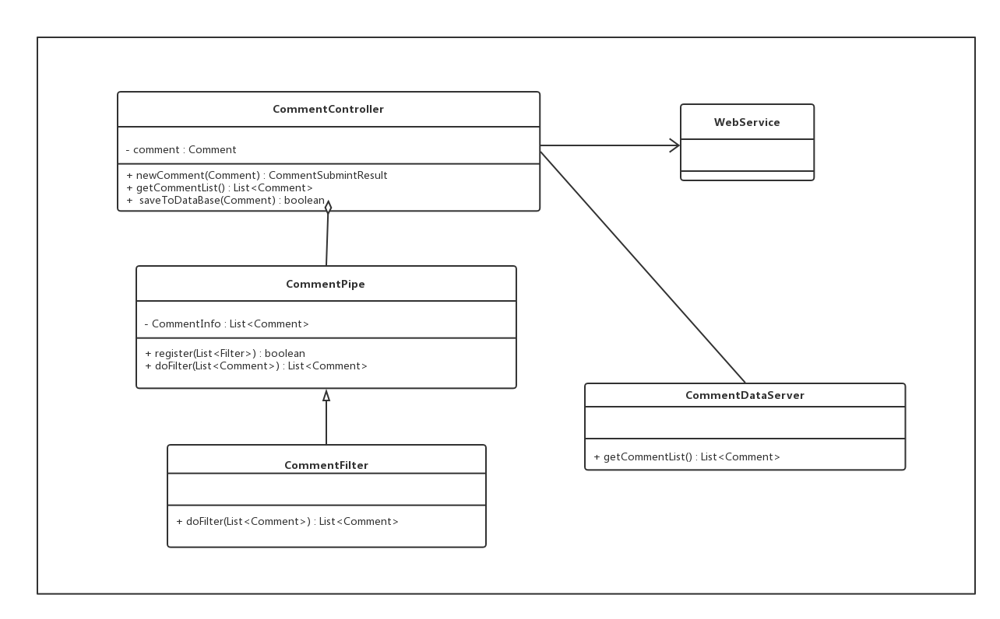
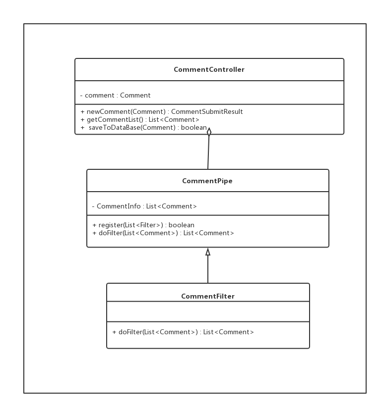

# 评论服务模块

## 词汇表 ##

| 英文| 中文 | 备注  |
| :--- | :--- | :--- |
|pipe |管道| |
|filter |过滤器| |

## 一、概述
### 1.1 承担的需求（主要秘密）

评论服务模块主要职责是处理含有敏感词的评论，并存储评论信息到数据库中

### 1.2 可能会修改的实现（次要秘密）
* 敏感词汇表可能更改
* 检测过滤敏感词汇算法可能更改

### 1.3涉及的相关质量属性 ###
* R13敏感词汇检测并通知

### 1.4 用例图

### 1.5 用例描述
1. 接收评论：获得用户输入的评论信息
2. 过滤评论信息：检测过滤评论信息中的敏感词汇
3. 存储评论信息：将合法的评论信息格式存储于对应数据库中

### 1.6 对外接口

**接口职责**

提供接口供获得用户评论信息

**接口方法**
* public CommentSubmitResult newComment(Comment comment) ;
	* 职责：为获得用户评论信息
	* 前置条件：无	
	* 后置条件：无
 
  
---
 
## 二、类的设计
### 2.1 类图

### 2.2 类描述

#### 2.2.1. CommentController类
**类职责**

该类是为获得用户输入的评论信息和获得数据库评论信息列表

**类方法：**

* public CommentSubmitResult newComment(Comment comment) ;
	* 职责：为获得用户评论信息
	* 前置条件：无	
	* 后置条件：无

* public List&lt<Comment&lt> getCommentList() ;
	* 职责：获得评论信息列表	
	* 前置条件：无	
	* 后置条件：无
	
* public boolean saveToDataBase(Comment comment) ;
	* 职责：存储评论信息到数据库
	* 前置条件：评论信息已被过滤处理	
	* 后置条件：更新数据库信息	
	
	
#### 2.2.2. CommentPipe类
**类职责**

该类是为传递评论信息

**类方法：**

*  public  boolean register(List&lt<Filter&lt> filters);
	* 职责：用于一个或多个过滤器注册	
	* 前置条件：无	
	* 后置条件：无

* public List&lt<Comment&lt> doFilter(List&lt<Comment&lt>) ;
	* 职责：传输评论数据信息给过滤器处理并获得处理好的数据
	* 前置条件：商品数据已被格式化	
	* 后置条件：无

#### 2.2.3. CommentFilter类
**类职责**

该类是为传递评论信息

**类方法：**

* public List&lt<Comment&lt> doFilter(List&lt<Comment&lt>) ;
	* 职责：检测并过滤含有敏感词的评论信息	
	* 前置条件：商品数据已被格式化	
	* 后置条件：传回Pipe中

#### 2.2.3. CommentDataServer类
**类职责**

该类是为获得评论信息列表

**类方法：**

* public List&lt<Comment&lt> getCommentList() ;
	* 职责：获得评论信息列表
	* 前置条件：评论信息不含敏感词汇	
	* 后置条件：无
	
---	
	
## 三、重要协作
### 3.1 顺序图

---

## 四、设计模式应用
### 4.1 策略模式
> 策略模式(Strategy Pattern)作为一种软件设计模式，指对象有某个行为，但是在不同的场景中，该行为有不同的实现算法。-- wikipedia

**使用场景**

过滤检测敏感词汇的算法可能更改

**策略模式在类图中的体现**

**要达到的效果**

避免了重复代码，，增强了可维护性
