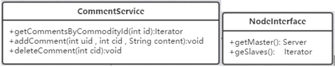

#
DataBaseCluster 模块 #

## 一、概述 ##
### 承担的需求（主要秘密） ###

数据库集群模块是系统中数据访问的抽象层，主要负责管理系统中存储评论数据的服务器，并提供大容量、高并发、高可用的数据服务。(本模块对应小组分工中的CommentDataService,DBCluster两个模块，因为CommentDataService模块太过简单所以合并到DBCluster模块中来)

### 可能会修改的实现（次要秘密） ###

* 数据分区算法
* 服务器负载均衡算法

### 涉及的相关质量属性 ###

* R1 数据可靠性
* R4 更新数据时系统可用
* R8 存储容量足够大
* R9 保证存取效率
* R10 高峰吞吐量

### 设计概述 ###
需要考虑的核心问题为：__
如何保证**大容量存储**、**高并发**、**高可用**？

* 一台服务器的存储容量总是有限的，为了实现大容量存储同时保持较高的性能，我们决定对数据进行**分区存储**，因此我们需要设计一个分区函数。此外，由于业务中的高频请求是获取某个商品的全部评论，而我们不希望把数据散布到不同的分区中去，因为那样会导致查询的效率大大降低另外还需要额外的合并结果集的处理。所以我们采用**商品ID**作为**分区键**，这样可以使得同一个商品的所有评论集中到一个分区中去，提高查询效率。

* 考察我们的业务需求可以发现：对于评论的数据，更多的是读操作，因为用户绝大多数情况下是在浏览商品，当发现其感兴趣的商品时才会点击该商品的详细信息，此时需要展示该商品的评论数据。只有当用户购买商品后才可以进行评论，也就是写操作，该操作的频率远低于读操作。所以我们采取**读写分离**的方式，每个节点都是一种** “主-从”模式**，写操作只在主服务器上进行然后同步到从服务器上。从服务器都是**只读**的，这样可以减轻服务器的读操作负载，从而支持更多的用户同时访问。为了实现这一点我们还需要一个负载均衡的策略。能够区分读写操作，并均衡读操作。

* 我们之前采取的分区和读写分离的架构都有助于提高系统的**可用性**，因为对数据进行分区意味着单个分区的数据故障并不会影响全局，分区使得故障的波及范围被限制在该分区内部。此外每个节点采用“主-从”模式，从服务器实际上也是对主服务器的**复制和备份**，这样做使得**单点故障时系统仍可运行**，并且能够在故障发生后及时地恢复。为此我们需要进行故障监测和故障恢复设计。当应用启动时，我们通过配置文件读取所有可用服务器信息（连接方式、角色），然后将可用的节点添加到节点池中。当某个服务器故障时故障检测模块会通知节电池更新可用节点。

综合以上考虑，我们决定在应用中搭建一个**数据访问抽象层**用于管理多个数据库服务器，并由该层统一处理所有数据访问。

该层的工作流程：

1. 外界调用预先定义的接口
2. 请求发送到请求转发器
3. 请求转发器首先根据请求中的参数商品号和分区策略决定存储该商品的评论数据的分区号，然后根据请求的类别决定是否进行负载均衡。写操作不需要进行负载均衡，直接转发到分区号对应的节点的主服务器进行写请求处理；读操作在转发之前需要根据负载均衡策略从目标节点中挑选合适的服务器然后再转发读请求。

补充流程：

1. 模块的初始化：

   节点池会请求监视器返回当前可用的全部节点，监视器根据配置文件获取可用的服务器连接信息，然后依次尝试获取各个服务器的连接，连接成功后再然后创建节点，最后将全部可用的节点数组返回。

2. 故障检测与应对：

  当监视器发现某个服务器出现故障无法响应时，将会通知节点池更新节点。

### 模块对外接口 ###
1. Iterator&ltComment&gt **getCommentsByCommodityId**(int cid);
2. void **addComment** (int uid , int cid , String content);
3. void **deleteComment** (int cid):void;

## 二、类的设计 ##

### 2.1 类图 ###

 

### 2.2 类描述 ###

#### CommentServiceImpl类 ####
##### 类职责 #####
该类负责处理实际的业务调用，是与其他模块进行交互的接口，当调用其来请求数据操作时，实际上会发送请求到由本模块其他部分构成的数据访问中间件。
##### 类方法 #####
* public Iterator getCommentsByCommodityId(int id);
* 职责：根据商品ID获取该商品的全部评论（核心接口）
* 前置条件：无
* 后置条件：返回商品的评论数据
* public void addComment(int uid , int cid , String content); 
* 职责：持久化评论
* 前置条件：成功购买商品
* 后置条件：持久化评论信息 
* public void deleteComment(int cid)
* 职责：删除评论
* 前置条件：用户为评论发布者或者管理员
* 后置条件：删除评论信息
---

#### RequestDispatcher类 ####
##### 类职责 #####
该类负责转发数据请求，首先请求转发器会根据请求中的参数商品号和分区策略决定存储该商品的评论数据的分区号，然后根据请求的类别决定是否进行负载均衡。写操作不需要进行负载均衡，直接转发到分区号对应的节点的主服务器进行写请求处理；读操作在转发之前需要根据负载均衡策略从目标节点中挑选合适的服务器然后再转发读请求。
##### 类方法 #####
* public int getServerId(int num)
* 职责：根据分区号计算响应写请求的服务器ID
* 前置条件：有新的写请求到达，并且已经确定分区号
* 后置条件：返回服务器ID

* public void dispatch(int num): 
* 职责：根据服务器ID把请求转发到相应的服务器
* 前置条件：无
* 后置条件：转发请求

---
#### RequestParser类 ####
##### 类职责 #####
本类的职责主要是分析请求的内容，获取商品Id，确定请求的类型。将该类从RequestDispatcher中分离出来是出于单一职责的考虑。

##### 类方法 #####
* public int getCommodityId(Request r);
* 职责：提取请求参数中的商品ID用于转发器处理
* 前置条件：有新的请求到达
* 后置条件：返回商品ID

* public boolean isReadRequest(Request r);
* 职责：判别请求的读写类别用于转发器区分处理
* 前置条件：有新的请求到达
* 后置条件：返回判断结果

---
#### PartitionStrategy接口 ####

##### 类职责 #####
由于分区的方式有很多，为了应对未来可能的对算法变更，我们应将行为抽象成接口，并将实现放在策略类的具体实现类中。HashStrategy和ModStrategy是目前采用的两种策略，HashStrategy是采用hash函数，将商品ID作为输入散列到节点数组中去；ModStrategy则是把商品ID对节点数组长取模然后确定数组下标。

##### 类方法 #####
* public int getPartitionNum(Request r);
* 职责：根据商品ID和分区策略计算分区号
* 前置条件：有新的请求到达
* 后置条件：返回分区号

---

#### BalanceStrategy接口 ####

##### 类职责 #####
由于负载均衡的方式有很多，为了应对未来可能的对算法变更，我们应将行为抽象成接口，并将实现放在策略类的具体实现类中。AverageStrategy和MinStrategy是目前采用的两种策略，AverageStrategy是采用循环分配的方式，例如该节点有ABC三台服务器，则每当有新的请求时就循环地发送给A、B、C三个服务器; MinStrategy是根据每个服务器当前的请求负载量来确定转发目标的，每次将新请求转发给负载最小的服务器。

##### 类方法 #####
* public int getServerIdWithLoadBalance (int num)
* 职责：根据分区号和负载均衡策略计算响应读请求的服务器ID
* 前置条件：有新的读请求到达，并且已经确定分区号
* 后置条件：返回服务器ID

---

#### Server类 ####
##### 类职责 #####
Server类其实是对可用的服务器资源的抽象表示，包含唯一的标识符ID和当前的状态Status，并提供处理请求的方法。

##### 类方法 #####
* public Response handleRequest(Request r);
* 职责：处理请求返回响应
* 前置条件：有请求到达
* 后置条件：发送响应
* public Status getStatus();
* 职责：返回服务器当前状态
* 前置条件：无
* 后置条件：返回状态
* public int getId();
* 职责：返回服务器ID
* 前置条件：无
* 后置条件：返回ID
* public void setId(int i);
* 职责：设置ID
* 前置条件：无
* 后置条件：设置ID

---

#### Node类 ####
##### 类职责 #####
Node类其实是对服务节点的抽象表示，每个节点包含一个主服务器和若干从服务器 

##### 类方法 #####
* public Server getMaster();
* 职责：获取当前节点的主服务器
* 前置条件：无
* 后置条件：返回主服务器引用
* public void setMaster(Server s);
* 职责：设置当前节点的主服务器
* 前置条件：无
* 后置条件：变更当前节点的主服务器
* public Iterator getSlaves();
* 职责：返回获取当前节点的从服务器
* 前置条件：无
* 后置条件：返回当前节点的从服务器
* public void setSlaves(Collection<Server> s);
* 职责：设置当前节点的从服务器
* 前置条件：无
* 后置条件：变更当前节点的从服务器

---

#### NodePool类 ####
##### 类职责 #####
本类是节点池的维护类，转发器包含其引用，将请求发送到适合的服务器上。该类包含一个节点的数组，并提供增添的方法，另外当服务器出现故障时，会被监视器通知更新节点池。该类实际上是监视器类的一个观察者。

##### 类方法 #####

* public void register(Node node);
* 职责：注册一个节点
* 前置条件：有新的可用节点出现并且当前节点池中不存在
* 后置条件：往节点池中添加一个节点
* public void remove(Node node);
* 职责：删除一个节点
* 前置条件：该节点不再存在
* 后置条件：从节点池中删除一个节点
* public void updateNode(int i, Node n);
* 职责：更新一个节点
* 前置条件：该节点当前故障或者出现其他变更需求
* 后置条件：更新一个节点
* public Node[] getNodes();
* 职责：返回节点数组
* 前置条件：无
* 后置条件：返回节点数组

---
#### Monitor类 ####
##### 类职责 #####
该类负责在项目启动时从配置文件中获取全部服务器的连接信息，然后根据此信息去尝试连接各个服务器，并按照配置将服务器组装成一个节点放入节点数组中供节电池获取。
在项目启动后，该类负责监控各个服务器，当某个服务器出现故障时会报告错误，并通知节电池更新节点。如果一个节点的从服务器故障，会创建一个不再包含故障服务器的节点，然后调用NodePool的updateNode()方法；如果一个节点的从服务器故障恢复又变为可用，会创建一个包含故障恢复的服务器的节点，然后调用NodePool的updateNode()方法如果一个节点的主服务器故障，会调用NodePool的remove()方法; 如果出现一个新的可用节点，会调用NodePool的register()方法;

节点池收到通知后会重新请求可用的节点数组，从而实现故障的检测的处理。 

##### 类方法 #####
* public Collection<Server> detectServer(); 
* 职责：检测可用的服务器
* 前置条件：无
* 后置条件：返回可用的服务器集合

* public Node createNode();
* 职责：根据配置创建节点
* 前置条件：该节点的主服务器可用
* 后置条件：返回节点

* public Node[] getAvaliableNodes;
* 职责：返回当前可用的全部节点
* 前置条件：无
* 后置条件：返回节点数组

* public void reportError();
* 职责：报告错误
* 前置条件：出现服务器故障
* 后置条件：报告错误并记录日志

* public void notify();
* 职责：通知节点池更新节点
* 前置条件：出现服务器变更
* 后置条件：发送通知

---

## 三、重要协作 ##
### 顺序图 ###
#### 数据请求转发顺序图 ####

 

---

#### 补充顺序图 ####

 

## 四、设计模式应用 ##

### 策略模式 ###

使用策略模式将类中易于变化的行为独立出来，声明为一个行为接口然后将实现存放于具体的实现类中，以适应开闭原则，使得行为变化时仅需要添加一个新的实现类即可。
本模块中两次使用了策略模式，在RequestDispatcher中持有PartitionStrategy和BalanceLoadStrategy的引用。

#### 类图体现 ####

---

### 迭代器模式 ###

使用迭代器模式使得在访问一个聚合对象的内容时无需暴露它的内部表示。
本模块中两次使用了迭代器模式，在CommentService中的getCommentsByCommodityId()方法中和NodeInterface中的getSlaves()方法均返回一个迭代器。

#### 类图体现 ####

