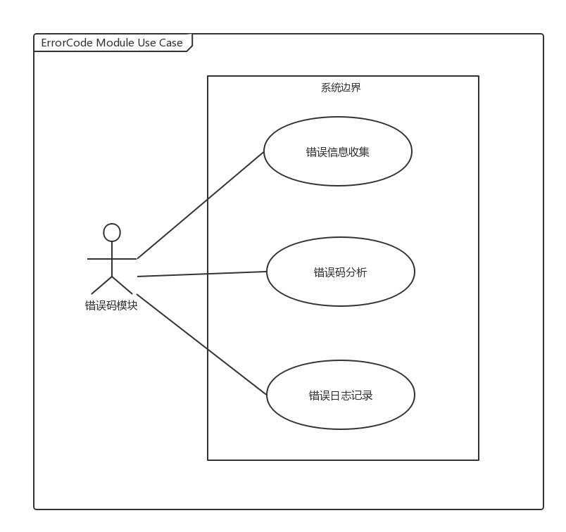
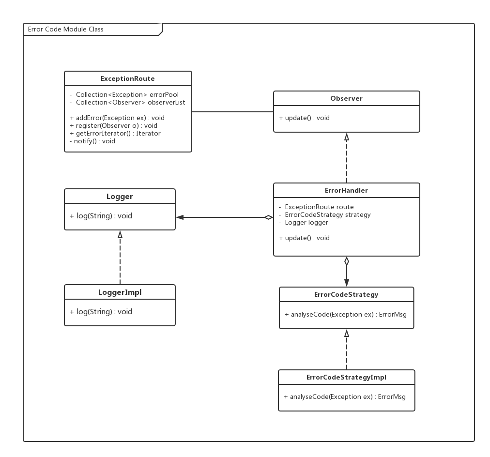
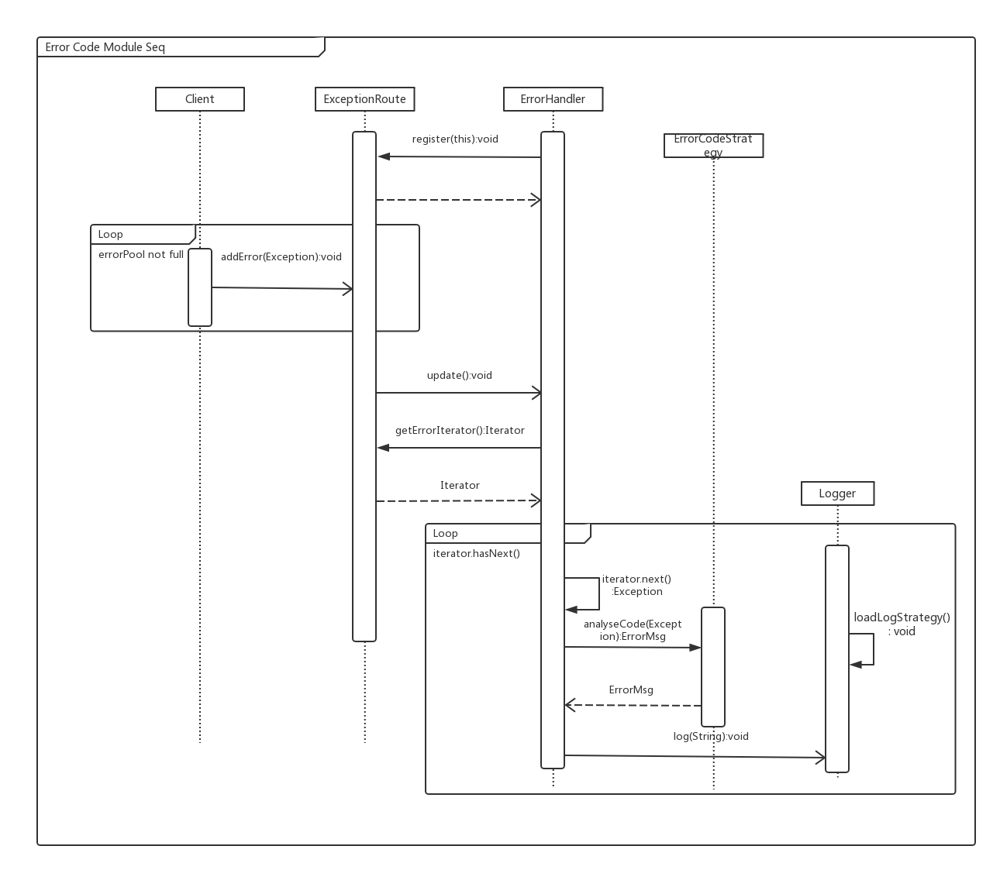
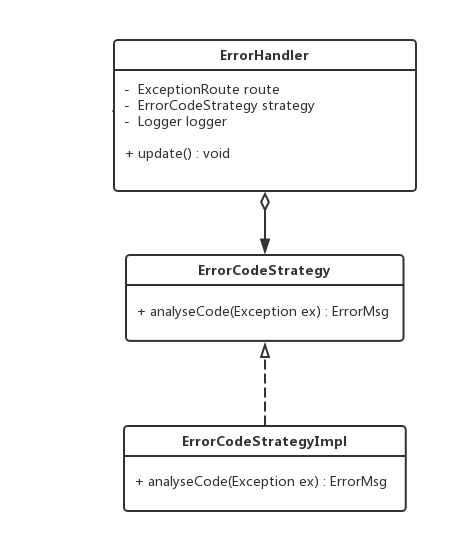
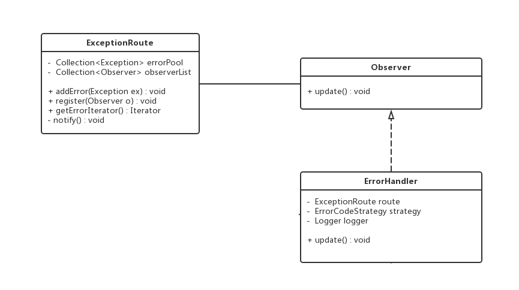

# 错误码模块
## 一、概述
### 1.1 承担的需求（主要秘密）
错误码模块负责统一处理系统各部分产生的错误信息，并为其制定有规律的错误码，然后将其记入日志中。错误码的制定规则要详细明了，可以根据错误码方便快捷的判断出系统出错的类别，从而迅速定位错误，方便诊断和排查。

### 1.2 质量属性要求
错误码处理模块要求有自身的高内聚性，不应该将错误码判定规则分散到系统产生错误的各个地方。而每个有可能产生错误的地方又都不可避免的直接或间接的与错误码分析模块产生联系，因此需要在这些地方注意控制耦合度，尽量将错误码分析和错误产生解耦。  
此外错误的产生和错误码的分析记录应该是异步的，这样可以不影响系统执行正常逻辑的性能，而在适当的时候再进行错误码分析记录。  
错误码分析的具体方式是典型的一个可变因素，因此系统要考虑错误码制定规则的可修改性和可扩展性，方便将来的规则修改。

### 1.3 用例图
  

### 1.4 用例描述
1. 错误信息收集的职责是统一收集系统不同部分产生的错误信息并通知错误码分析子模块进行分析。错误信息收集时采用**隐式调用**的体系结构风格，错误产生者只是简单的“*抛出*”包含错误基本信息的Event，后续调用过程它并不关心。
2. 错误码分析的职责是集中分析错误信息的类型并为其制定规则明确的错误码。错误码制定的规则是一个典型的策略，因此需要考略将来的修改和扩展。
3. 错误日志记录的职责是将错误码分析的结果记入日志，日志记录格式应该是可修改的，具体格式可由配置文件制定，系统再启动时读取配置文件即可。

### 1.5 可能会修改的实现（次要秘密）
1. 错误码的制定规则
2. 日志记录的格式

### 1.6 角色
1. //TODO

### 1.7 对外接口

void addError(Exception ex);

## 二、类的设计

### 2.1 类图

### 2.2 类描述

#### 2.2.1 ExceptionRoute类
该类是集中收集系统各处抛出的错误信息的类，同时也是一个**被观察者**，它将错误信息缓存在内部集合中，并在适当的时候通知观察者前来获取、分析错误信息。

**类方法**

| 类方法 | 描述 |
| :------------- | :------------- |
| public void addError(Exception ex) | 提供给错误信息产生着使用的记录错误接口，将错误信息缓存到待处理集合中 前置条件：无 后置条件：缓存错误信息 |
| public void register(Observer o) | 注册观察者，用于后续通知观察者 前置条件：无 后置条件：将观察者添加到队列中 |
| public Iterator getErrorIterator() | 返回给观察者错误信息集合的迭代器，用于观察者的错误分析 前置条件：route通知观察者进行数据更新 后置条件：返回迭代器 |
| private void notify() | 通知所有的观察者来获取新的错误信息 前置条件：错误信息缓存集合已满或到达预订时间间隔 后置条件：通知观察者获取新数据 |

**数据结构**

| 数据结构 | 描述 |
| :------------- | :------------- |
| Collection<Exception> errorPool | 缓存错误信息的缓存池，当其达到特定容量后会触发通知观察者前来处理错误 |
| Collection<Observer> observerList | 观察者队列，记录需要被通知的观察者 |

#### 2.2.2 Observer接口
观察者需要实现的接口，定义了观察者最基本的update操作，具体执行内容取决于具体实现类。

**类方法**

| 类方法 | 描述 |
| :------------- | :------------- |
| public void update() | 当被观察者数据更新时，触发观察者进行读取操作的方法 前置条件：被观察者数据发生更新 后置条件：观察者向被观察者请求获取新的数据 |

**数据结构**

无重要数据结构。

#### 2.2.3 ErrorHandler类
错误码模块的核心控制类，它也是ExceptionRoute的观察者，负责从route获取错误消息，并调用具体分析策略进行错误处理，最后记录错误码和错误信息。

**类方法**

| 类方法 | 描述 |
| :------------- | :------------- |
| public void update() | 从route获取错误消息，分析并记录，本方法是所有逻辑的控制方法，具体实现委托给其他类 前置条件：无 后置条件：无 |

**数据结构**

| 数据结构 | 描述 |
| :------------- | :------------- |
| ExceptionRoute route | 被观察者的引用，用于获取错误消息 |
| ErrorCodeStrategy strategy | 实现错误码编码功能的策略类的引用，用于在分析错误码时进行转发 |
| Logger logger | 日志记录策略类，用于记录日志时进行转发 |

#### 2.2.4 ErrorCodeStrategy接口
执行具体错误码编码任务的策略类接口，其负责根据特定规则产生错误码和错误描述信息。

**类方法**

| 类方法 | 描述 |
| :------------- | :------------- |
| public ErrorMsg analyseCode(Exception ex) | 错误码分析方法，根据Exception类型和具体内容产生简洁的易于记录和分析的错误码和错误描述信息 前置条件：无 后置条件：返回错误码分析结果 |

> **注：** 返回类型ErrorMsg为简单的POJO，其内部包含错误码(`int`类型)和错误描述信息(`String`类型)，这里不再对其进行具体描述。

**数据结构**

无重要数据结构。

#### 2.2.5 ErrorCodeStrategyImpl类
ErrorCodeStrategy接口的实现类，具体功能参加ErrorCodeStrategy接口的描述。

**类方法**

同上文中`ErrorCodeStrategy`接口。

**数据结构**

同上文中`ErrorCodeStrategy`接口。

#### 2.2.6 Logger接口
日志记录操作的抽象接口，定义了常用的日志记录操作，其具体实现取决于实现类的配置。

**类方法**

| 类方法 | 描述 |
| :------------- | :------------- |
| public void debug(String) | 采用debug级别的日志记录 |
| public void info(String) | 采用info级别的日志记录 |
| public void warn(String) | 采用warn级别的日志记录 |
| public void error(String) | 采用error级别的日志记录 |

**数据结构**

无重要数据结构。

#### 2.2.5. LoggerImpl类
日志记录操作的实现类，其可根据配置文件的内容自定义日志记录格式等具体记录细节。该类是单例，即只有一个对象实例，这样可以保证记录日志时不会因为多个类对同一份日志文件的并行写入而产生错误。

**类方法**

同上文中`Logger`接口。

**数据结构**

同上文中`Logger`接口。

## 三、重要协作
### 3.1 顺序图

## 四、设计模式应用
### 4.1 策略模式
策略模式能够将系统在局部上一些实现细节的不确定性封装起来，易于在将来甚至是运行时的修改。在本模块中，错误码的制定规则是一个典型的策略，因此将其分析逻辑封装在一个单独的类`ErrorCodeStrategy`中，执行分析时由`ErrorHandler`调用其获得结果即可。

策略模式在类图中的体现如下图：  

### 4.2 观察者模式
观察者模式用于在被观察对象发生变化时能够及时通知观察者采取一定操作，此模式基于隐式调用的风格，能够有效减少系统的耦合度。在错误码模块中，`ExceptionRoute`充当被观察者的角色，在收集到的异常达到一定数量时，`ExceptionRoute`就会触发观察者`ErrorHandler`的`update()`方法，后者接着会采取相应措施读取Exception的信息并进行接下来的分析操作。

观察者模式在类图中的体现如下图：  

观察者模式的采用将异常信息的抛出者和异常错误码处理类相解耦，使得`ErrorHandler`只需要关心`ExceptionRoute`的变化即可。

### 4.3 迭代器模式
迭代器模式常在发生集合的遍历时使用，其可以隐藏集合的具体实现方式，只提供给client需要的基础遍历方法(常为`next()`方法)，起到了信息隐藏的作用。在本模块中，`ErrorHandler`在从`ExceptionRoute`获取异常信息集合的时候就采用了迭代器模式，route只返回一个`Iterator`，这样就能满足`ErrorHandler`的遍历需要并不暴露出细节。`ErrorHandler`拿到迭代器后，遍历其中每一个异常对象，分别调用分析策略分析错误码，从而完成任务。
