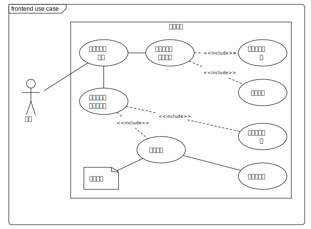
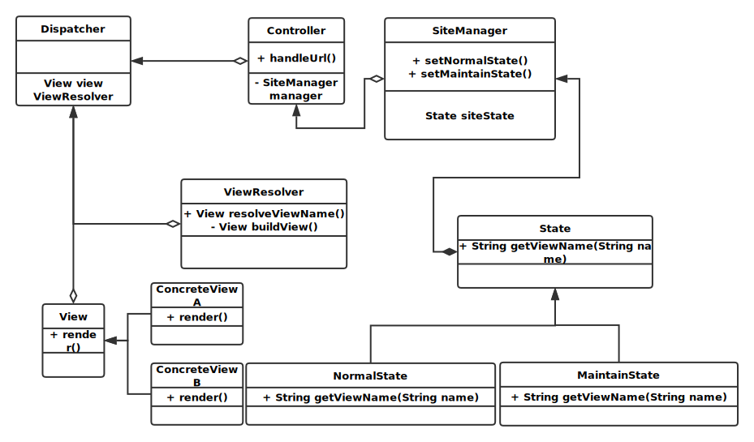
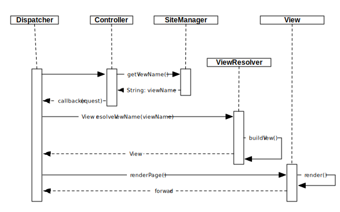

# 前端模块 #

## 一、概述 ##
### 承担的需求（主要秘密） ###

1. 负责前端视图模板的管理，能根据相应的视图名称来渲染相应的符合业务需求的视图
2. 负责前端视图渲染方式的管理，能根据需求切换不同的视图渲染方式，以保持高度的前端视图页面构建的灵活性
3. 负责前端视图状态的管理，能根据生产需求切换当前的视图状态来应对不同的生产环境，同时也需要保持视图状态的可扩展性，目前支持的视图状态有：
   1. 正常状态，根据路由正常返回相应的视图
   2. 维护状态，返回统一的维护提示页面，或者若有重要的页面需要显示额外信息也可以将其模板标记为维护提示用的模板，以便在维护状态中返回相应的维护信息页面

### 用例图设计 ###

### 可能会修改的实现（次要秘密） ###

1. 模板格式
2. 模板处理器的实现方式
3. 前端视图状态

### 角色 ###

Gateway: 所有外部请求需要统一由网关处理和转发，前端模块的业务同样也受网关的控制

## 二、类的设计 ##

### 2.1 类图 ###

### 2.2 类描述 ###
#### 1. Dispatcher类 ####

|              类方法               |              描述              |
| :---------------------------- | :-------------------------- |
| public void handle(String url) | 根据传入的url来决定对url执行的操作 **前置条件**:无 **后置条件:无** |

#### 2. View接口 ####

|         接口方法          |         描述         |
| :-------------------: | :----------------: |
| public  void render() | 根据自身属性来渲染一个具体的页面内容 |

#### 3. ConcreteView类 ####

实现View接口，以便保证使用不同的方式来渲染一个页面的具体内容

|          类方法          |         描述         |
| :------------------- | :---------------- |
| public  void render() | 根据自身属性来渲染一个具体的页面内容 **前置条件**:对象已经实例化 **后置条件**:构建一个相应的视图对象，并转发到客户端 |

#### 4. ViewResolver类 ####

| 类方法  |  描述  |
| :-- | :-- |
| public View resolveViewName()| 根据上下文和传入的视图名称来构建一个具体的视图对象 **前置条件**:对象已经实例化 **后置条件**:生成一个视图对象|
| private View buildView()| 私有方法，根据自身的属性来构建一个视图对象 **前置条件**:对象已经实例化 **后置条件**:生成一个视图对象|

#### 5. Controller类 ####

负责接收dispatcher的路由转发，执行相应的业务逻辑

#### 6. SiteManager类 ####

| 类方法  |  描述  |
| :-- | :-- |
| public View resolveViewName()| 根据上下文和传入的视图名称来构建一个具体的视图对象 **前置条件**:对象已经实例化 **后置条件**:生成一个视图对象|
| public View switchToNormal()| 将当前的服务状态切换为正常状态 **前置条件**:对象已经实例化 **后置条件**:当前状态对象变为NormalState实例|
| public View switchToMaintain()|  将当前的服务状态切换为维护状态 **前置条件**:对象已经实例化 **后置条件**:当前状态对象变为MaintainState实例|

| 重要实例属性  |  描述  |
| :-- | :-- |
|State state| 表示当前网站的服务状态|

#### 7. State类 ####
对当前网站服务状态的抽象

| 类方法  |  描述  |
| :-- | :-- |
| public View getViewName(String viewName)| 对传入的视图名称做处理 **前置条件**:对象已经实例化 **后置条件**:根据状态返回一个应该被显示的视图的名称|

#### 8. NormalState类 ####

| 类方法  |  描述  |
| :-- | :-- |
| public View getViewName(String viewName)| 正常状态下直接正常返回原有的视图名称 **前置条件**:对象已经实例化 **后置条件**:不对传入的ViewName做处理|

#### 9. MaintainState类 ####

| 类方法  |  描述  |
| :-- | :-- |
| public View getViewName(String viewName)| 维护状态下返回维护提示视图的名称 **前置条件**:对象已经实例化 **后置条件**:统一返回维护页面的视图名称|
## 三、重要协作 ##
### 顺序图 ###

## 四、设计模式应用 ##

### 单件模式 ###

使用单件模式保证每次引用的网站服务状态管理器都是同一个，从而维护相同的状态

### 状态模式 ###

将网站不同的状态用不同的状态子类来表示，既保持了统一的操作，又保证了服务状态的可扩展性

### 前端控制器模式 ###

由一个对象来统一维护所有请求，并且决定请求的分发

### MVC模式 ###

独立地处理数据模型，视图和控制器