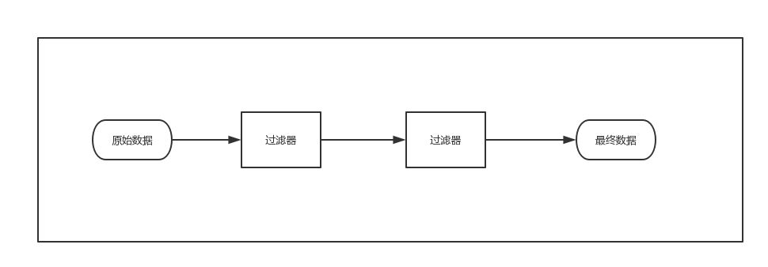
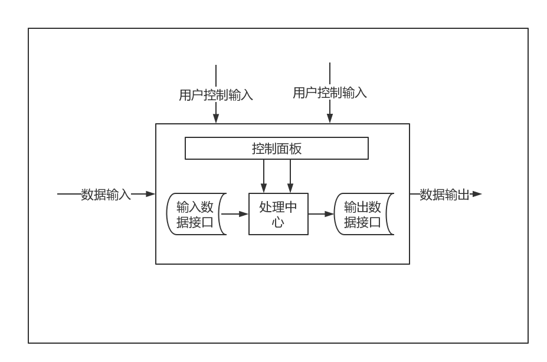
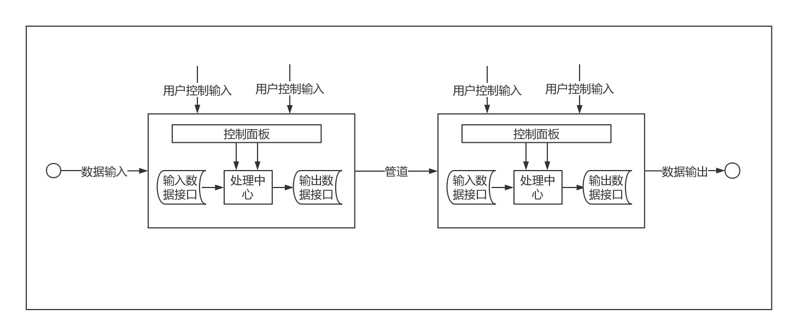
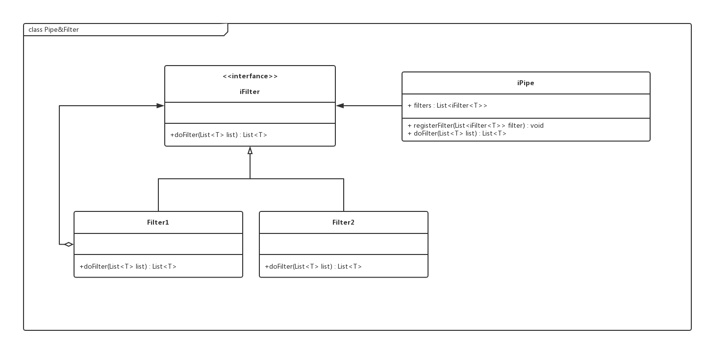

# 管道与过滤器模块

## 词汇表 ##

| 英文| 中文 | 备注  |
| :--- | :--- | :--- |
| Pipe |管道| |
| Filter  |过滤器  |

## 一、概述
### 1.1 承担的需求（主要秘密）
管道与过滤器模块中（1）构件被称为过滤器，它对输入流进行处理、转换，处理后的结果在输出端输出。这种计算结构支持递进，在全部的输入接受完之前就开始输出，过滤器可并行使用。（2）连接件位于过滤器之间，起到信息流导管的作用，称为管道。（3）每个组件都有输入/输出集合，构建在输入处读取数据流，并在输出处生成数据流。过滤器是独立实体，不需要了解信息流将流入哪个过滤器。过滤器可以指定输入的格式并确保输出结果。过滤器之间不共享状态。管道与过滤器构成的网络的输出不依赖于过滤器的递进处理顺序。

### 1.2 可能会修改的实现（次要秘密）
* 管道与过滤器实现使用的设计模式

### 1.3涉及的相关质量属性 ###

* 良好的隐蔽性
* 高内聚、低耦合
* 支持软件重用
* 增强系统性能
* 易维护性
* 高效性

### 1.4 用例图

### 1.5 用例描述
1. 管道进行数据传输，起到信息流导管的作用。
2. 过滤器向管道注册。
3. 过滤器对经过管道输入流进行处理、转换。
4. 过滤器负责将处理后的结果在输出端输出经过管道传递给需要的模块。

### 1.6 角色
1. 传递数据：
管道传输待处理或者处理好的数据
2. 注册：
管道提供方法供一个或多个过滤器注册使用
3. 处理输入数据：
过滤器根据需求处理、转换输入流
4. 输出数据：
过滤器输出数据到管道

### 1.7 对外接口

与SearchServer和CommentServer之间的接口

**接口职责**
供server传入待处理的数据，返回处理好的数据

**接口方法**
*　public List\<T\> doFilter(List\<T\> list) 

  * 职责：供server传入待处理的数据，返回处理好的数据
  * 前置条件：输入流已就绪
  * 后置条件：更新数据内容
  
## 二、类的设计
### 2.1 类图采用
- 采用组合模式设计类图

### 2.2 类描述

#### 2.2.1. iFilter 接口
为了适用于一个或多个过滤器，并在不同情况下使用，以增加重用性，选择组合模式将过滤器抽象成接口，做到依赖抽象而不是实现，将具体实现封装。 在接口中申明doFilter方法并由具体的Filter类实现。

#### 2.2.2. Filter1 类 、Filter2 类
**类职责**

这些类是iFilter接口的具体实现类，实现了接口中申明的方法，并且数量在未来可能增加

**类方法：**

*  public  List\<T\> doFilter(List\<T\> list)

  * 职责：传入数据并按需处理再将数据返回 
  * 前置条件：数据通过管道传递过来
  * 后置条件：处理好的数据通过管道传出

#### 2.2.3. iPipe类

**类职责**

该类的职责是供Filter注册使用，并传输数据

**类方法**
* public void registerFilter(List\<iFilter\<T\>\> filter) 

  * 职责：供一个或多个过滤器注册
  * 前置条件：filter已创建
  * 后置条件：filter已注册完成
  
  
* public List\<T\> doFilter(List\<T\> list)

  * 职责：对已注册的过滤器，管道传入数据，由过滤器按需处理，并返回处理好的数据
  * 前置条件：输入流已就绪
  * 后置条件：更新数据内容
  
## 三、重要协作
### 3.1 流程图
基本管道-过滤器模式的流程图如下：

管道-过滤器模型适于数据流的处理和变换，不适合与用户交互频繁的系统建模。在这种模型中，每个过滤器都有自己的数据，整个系统没有一个共享的数据区。这样，对于需要多个过滤器处理某一项数据时，实现较为复杂。为解决管道-过滤器模型这一交互式处理能力若的特点，可以对每个过滤器增加相应的用户控制接口，使得外部可以对过滤器的执行进行控制。

整个系统的体系结构流程图如下：

### 3.2 状态图
设计过滤器状态有如下：停止状态，工作状态，等待状态，休眠状态。

停止状态：表示过滤器处于待启动状态，当外部启动过滤器后，过滤器处于处理状态；

处理状态：表示多虑器正在处理输入队列中的数据；

等待状态：表示过滤器的额输入数据队列为空，此时过滤器登台，当有新的数据输入时，过滤器处于处理状态；

休眠状态：表示多启动，但被挂起。挂起的原因可能是由于外界用于要设置过滤器的控制参数，这样暂时将过滤器挂起但不中止它，，当控制参数设置完毕后再将过滤器还原，继续运行。这样，实现了较高的效率。

### 3.3 顺序图
管道过滤器模块顺序图

## 四、设计模式应用
### 4.1 组合模式

**使用场景**

如果是filter下仍有多个filter，一个中间过滤器下面还一棵树，构成过滤器树。

**组合模式在类图中的体现**

**要达到的效果**

要求过滤对象满足其包含的所有子filter,但不关注子filter的实现；
依赖抽象而不依赖实现；体现出具有层次之别的过滤器族，强调“整体-部分”的特性。

