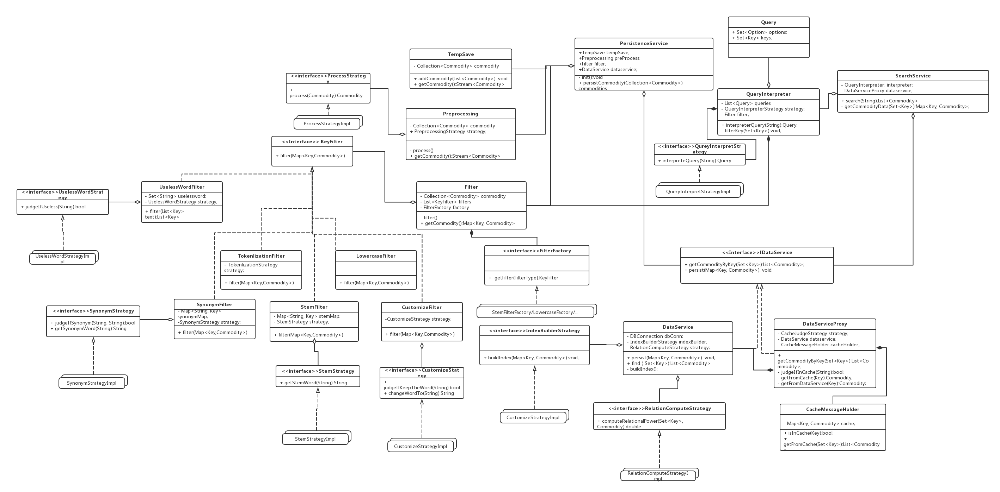
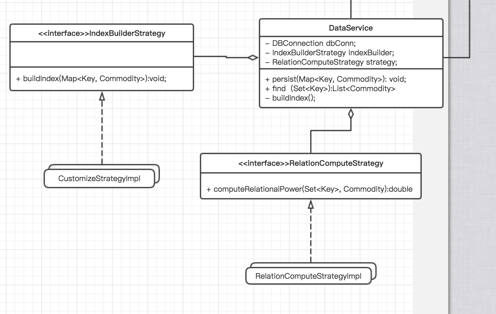
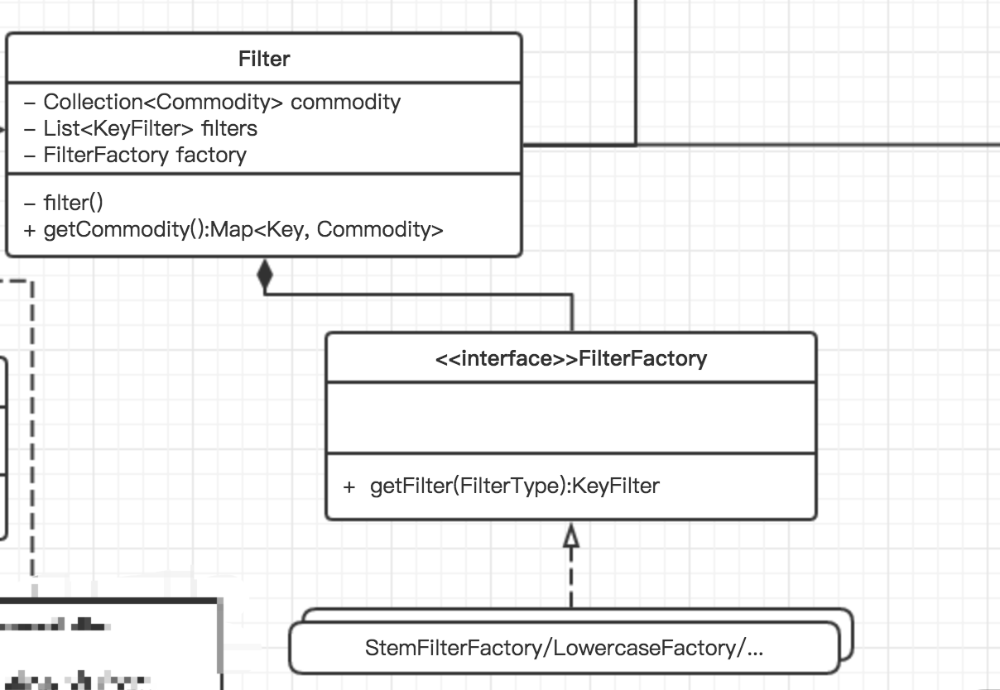
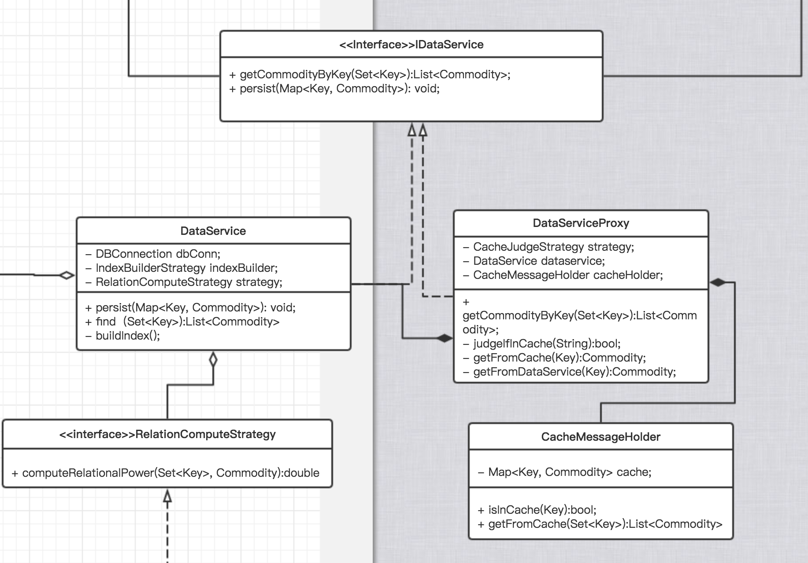

# SerachEngine 模块 #

## 词汇表 ##

| 英文| 中文 | 备注  |
| :--- | :--- | :--- |
| Tokenlization  |序列化| |
| Normalization  |标准化  |
|Front Service|前端服务| 前端是相对而言的,这里是指调用搜索服务的一方|
|Data Provider| 数据提供者 | 如爬虫|
|Query| 查询语言|内部定义的查询语言类|

## 一、概述 ##
### 承担的需求（主要秘密） ###
搜索引擎模块主要负责将爬虫获取的数据存储到数据库中并提供给前端一个高效可用的搜索接口。

### 可能会修改的实现（次要秘密） ###
	
* 商品信息预处理算法
* 分域存储算法
* 无效关键字检测算法
* 同义词匹配算法
* 同根词匹配算法
* 词汇优先级算法
* 高频访问缓存算法

### 涉及的相关质量属性 ###

* R1 数据可靠性
* R6 搜索易用性
* R9 保证存取效率

### 设计概述 ###
其需要考虑的核心问题为：如何组织数据使得搜索变得高效。这个问题是由于搜索是系统的核心功能，相比于存储而言，搜索发生的频率会**更高且更集中**。由于商品的数据是**非结构化**数据，为了实现高效搜索，以保证服务器的**高可靠性和高可用性**，我们应当需要在数据存储的时候为它们建立适当的索引，并优化搜索结构，使得搜索能够快速高效的进行。为了实现以上设想，提出了以下存储流程设计：

1. 在存储数据的之前，首先对数据进行**预处理**。例如额外增加一个域：数据增加时间。这个域有以下用途：
	* 用于未来搜索可能的过滤条件，如仅仅返回特定时间之后的数据
	* 作为判定数据相关性权重的一个判定标准。顾客搜索商品肯定不太愿意搜索到过时的商品，因此时间较为久远的商品在计算相关性时应当较低 

2. 存储数据时，**分域存储**，如标题，描述，价格，图片，链接等。分域存储有以下考虑：
	* 使非结构化的商品信息部分变得结构化，便于搜索
	* 使得搜索时可以以某些域作为过滤的条件（如价格）
	* 每个域可以有不同的权重值作为
	
3. 商品存储完成之后，为其建立索引，用于现时段搜索主要是基于关键字搜索，因此索引也基于关键字建立。然而在建立关键字索引时有以下问题考虑：
	* 无效关键字：中文如“的” “你” “我”， 英文如"this", "that"等
	* 同义词如 华为,“huawei”， “tf卡”&“手机存储卡”
	* 同根词:主要是英文网站中的词汇，如 "created"&"creation"
	* 不同词汇优先级不同，如搜索华为手机，则华为二字的优先级相比手机更高（因其频率较低）
	* 不同关键字访问频率不同，有些商品会被频繁访问
	

	为了解决以上问题，我们需要一系列的处理流程来建立索引：
	
	* Tokenlization:序列化，移除标点符号，移除无效关键字
	* Normalization:token标准化，用一系列的filter来处理
		* Lowercase Filter: 全部转化为小写（针对英文）
		* Synonym Filter: 同义词用一个代替
		* Stem Filter: 转为为词干（中文则去除无效的介词等等）
	* Cache: 若包含高频关键字，将该商品信息纳入缓存中
	
	除了存储爬虫获取的信息外，本模块另一个重要的功能就是提供高效快速地检索，既然数据已经被有条理的存储在了数据库中，那么我们就应当合理的去利用这些已经优化过了的数据。因此，提出以下搜索的流程：
	1. 同存储一样，搜索的关键字也需要进行**过滤器处理**，以使得关键词与数据库中的索引的关键词一致。因此filter必须要保持一致，才能确保检索时有效的（工厂模式）
	2. 经过filter处理之后获得关键字，优先在高频检索结果中（缓存）查找，之后根据设定的优先级算法，在数据库中查找，返回指定的高优先级的结果
	3. 将查找过得结果发送到排序模块（默认按相关性返回，但是允许修改排序算法），之后返回
	
	这就是整个Search Engine模块的整体思想，下面通过用例图进行说明。
	

### 用例图设计 ###

#### 用例图补充说明： ####
该用例图表明了系统中存在两个外界用户，一个是前端调用搜索接口的程序，及需要存储数据的爬虫。

##### 存储模块 #####
* 当爬虫发送数据过来的时候，由于一次可能发送大量数据，因此需要先有缓存模块(TempSave)，暂时存放数据，并以流式方式提供给预处理模块(Preprocessing)
* 预处理模块执行商品信息结构化及分域存储，增加额外信息域等工作
* 过滤器模块执行商品正文信息索引建立的处理工作，抽取出核心关键词
* DAO模块负责存储数据
* 索引建立器模块负责建立索引

##### 搜索模块 #####
* 首先由查询解释器（Query Interpreter）进行查询语言解析
* 对需要查询的文本，进行filter过滤，提取出与索引一致的关键字
* 根据关键字，由Cache Judege模块判定是否有缓存，若有查找缓存中对应数据，否则根据索引查找器进行查找

### 角色 ###
* Front Service: 调用搜索服务者
* Data Provider: 提供商品数据
* Search Service：搜索服务总模块，提供搜索服务
	* Query Interpreter: 查询解释器，解释用户查询语言，从中分解出查询条件
	* Filter：过滤模块，负责将关键字Token化，标准化，以提高搜索命中率和搜索速度
		* Tokenlization： 将非结构化文本变为Token流
		* Normalization： 将Token正则化
				 	  
	* CacheJudge：判定是否搜索的关键字是否在缓存中
	* Cache：缓存模块
	* IndexSearcher：索引搜索模块，根据索引寻找搜索结果
	* Sort：排序模块
* Persistence Service：商品信息持久化总模块，提供存储商品信息服务
	* TempSave：暂时存储Data Provider传来的数据，并以流式方式进行存储
	* Preprocessing：预处理模块，执行商品信息结构化及分域存储，增加额外信息域等工作
	* Filter模块：同SearchService中Filter模块的描述
	* DAO：数据库持久化相关模块，负责存储数据并建立索引
	* Index Builder：根据已经生成的关键字流建立索引

### 模块对外接口 ###
1. Collection&lt;CommodityInfo&gt; **search**(String message, Collection&lt;Option&gt; Options);
2. void **persist**(Collection&lt;CommodityInfo&gt; commodities);

## 二、类的设计 ##

### 2.1 类图 ###

### 2.2 类描述 ###
#### PersistenceService类 ####
##### 类职责 #####
本类为SearchEngine模块的核心类之一，为存储模块的核心控制器，存储模块采用的设计风格为主程序-子程序风格，而PersistenceService类内持有TempSave、Preprocessing等类的引用，并封装了存储的逻辑。

##### 类方法 #####
* private void init(): 
	* 职责：初始化组件，检查数据库连通性
	* 前置条件：系统初始化完成
	* 后置条件：完成PersistenceService类的初始化
* public void persistCommodity(Collection&lt;Commodity&gt;); 核心对外接口，提供持久化商品的接口
	* 职责：持久化商品信息
	* 前置条件：类初始化完成
	* 后置条件：持久化商品数据，并建立索引

---

#### TempSave类 ####
##### 类职责 #####
本类的职责是暂时存储DataProvider传过来的大量数据，并以流的方式提供商品的数据。

##### 类方法 #####
* public void addCommodity(List&lt;Commodity&gt;)
	* 职责：增加商品信息到临时存储空间中
	* 前置条件：类初始化完成
	* 后置条件：将商品信息转化成流式暂时存储

* public void getCommodity():Stream&lt;Commodity&gt;
	* 职责：返回缓存池里未持久化的信息
	* 前置条件：类初始化完成
	* 后置条件：返回未持久化的商品信息

---

#### PreProcessing类 ####
##### 类职责 #####
本类的职责主要是预处理Commodity，并将预处理过后的Commodity信息以流的形式返回。
可能的预处理逻辑包括增加域，修改域的信息，如将字符串时间转化为时间戳等
预处理的逻辑可能变化，因此采用策略模式，将具体的预处理逻辑放在PreProcessStrategy中

##### 类方法 #####
* public void getCommodity():Stream&lt;Commodity&gt;
	* 职责：返回预处理后的信息
	* 前置条件：从TempSave类处获取数据
	* 后置条件：返回预处理后的商品信息流

* private void process()
	* 职责：预处理信息，调用PreProcessStrategy实现
	* 前置条件：预处理策略已设置
	* 后置条件：完成预处理

---

#### Filter类 ####
##### 类职责 #####
Filter类是建立索引的关键类，它持有一系列的过滤器，逐个执行，以实现从文本信息这种非结构数据中抽取出有效的关键字，利于后期建立索引。并返回一个Map，包含关键字和其商品信息。

##### 类方法 #####
* private void initFilter();
	* 职责：通过调用FilterFactory生成一系列的Filter实例
	* 前置条件：无
	* 后置条件：完成filter的初始化

* private void filter();
	* 职责：循环调用持有的所有Filter
	* 前置条件：无
	* 后置条件：完成过滤

* public Map&lt;Key, Commodity&gt; getCommodity();
	* 职责：返回经过过滤的商品信息键值对
	* 前置条件：商品信息过滤完成
	* 后置条件：返回经过过滤的商品信息键值对

---

#### KeyFilter接口 ####
##### 接口职责 #####
KeyFilter接口定义了所有关键字Filter类必须实现的接口，便于Filter类统一调度

##### 接口方法 #####
* public Map<Key, Commodity> filter(Map&lt;Key, Commodity&gt;);
	* 职责：按照类的策略对商品关键字进行过滤
	* 前置条件：商品信息已经经过预处理
	* 后置条件：返回经过当前类过滤的商品

---

#### TokenlizationFilter类 ####
##### 类职责 #####
将商品信息变成Token流，方便之后的filter进行处理

##### 类方法 #####
同KeyFilter接口方法描述

---

#### LowercaseFilter类 ####
##### 类职责 #####
将Token（Key）全部小写化处理

##### 类方法 #####
同KeyFilter接口方法描述

---

#### SynonymFilter类 ####
##### 类职责 #####
维护一个同义词的Map，该Map存储了关键字的等价类表示，将关键词替换为等价的类

##### 类方法 #####
同KeyFilter接口方法描述

---

#### StemFilter类 ####
##### 类职责 #####
维护一个包含词到词干映射的Map，将关键词转化为其词干

##### 类方法 #####
同KeyFilter接口方法描述

---

#### CustomizeFilter类 ####
##### 类职责 #####
允许赞助商（或其他用户）按照他们想要的方式去存储数据，以便以特定的方式被检索出来，这个类是为了预留可能的新的过滤模块而设计的，可能有多个实现子类。

##### 类方法 #####
同KeyFilter接口方法描述

---

#### FilteFactory类 ####
##### 类职责 #####
负责封装具体Filter类的创建代码，以降低Filter和具体Filter类间的耦合

##### 类方法 #####
* Filter getFilter(FilterType type);
	* 职责：生成并返回指定类型的Filter
	* 前置条件：无
	* 后置条件：返回指定类型的Filter

---

#### \*FilterStrategy接口 ####

##### 类职责 #####
由于过滤器大多使用了策略模式来控制可能的变更，因此存在大量的Strategy类，为了减少繁冗的说明，在这里一并说明。其主要考虑基本是为了能够更好地复用这些策略，更加符合开闭原则，避免未来可能的对算法的修改破坏原来类的封装性，于是将行为抽象成接口，并将实现放在策略类的具体实现类中。

注： 此处的"\*FilterStrategy"指代所有以“\*FilterStrategy”结尾的接口，下文impl同

##### 类方法 #####
* UselessWordStrategy::judgeIfUseless(String):判断token是否为无效词
* SynonymStrategy::judgeIfSynonym(String, String):判断两Token是否为同义词
* SynonymStrategy::getSynonymWord(String):返回一个关键词的同义词（只返回一个，即所有同义词形成的等价类中的一个）
* StemStrategy::getStemWord(String):返回一个关键词的词干
* CustomizeStrategy::judgeIfKeepTheWord(String):判断是否保留一个关键字，如否，关键字将被剔除
* CustomizeStrategy::changeWord(String):将一个关键字修改为返回值

---

#### \*FilterStrategyImpl类 ####
##### 类职责 #####
为\*FilterStrategy的实现类，可以有多个实例，职责参照对应的\*FilterStrategy接口描述

##### 类方法 #####
同接口描述

---

#### IDataService接口 ####
##### 接口职责 #####
IDataService接口是为了使用代理模式，避免直接操作数据库而产生的接口，具体设计原因可参照设计模式中的代理模式中的详细描述。该接口主要定义了读取和存储两个方法

##### 接口方法 #####
* public void persist(Map&lt;Key, Commodity&gt;)
	* 职责：存储商品
	* 前置条件：商品关键字已经过过滤处理
	* 后置条件：持久化商品信息并建立索引
* public List&lt;Commodity&gt; getCommodityByKey(Set&lt;Key&gt;);
	* 职责：根据关键字返回相关度最高的商品信息
	* 前置条件：关键字已经经过过滤
	* 后置条件：返回相关度最高的商品信息

---

#### DataService类 ####
##### 类职责 #####
DataService类负责封装与数据库交互的实现，并对外提供存储以及根据索引访问的接口。除了存储商品信息外，DataService还需要根据对关键字建立倒序索引，即每个关键字在哪些商品的信息描述中出现了。这些都是必要的，将极大程度的改善搜索的效率。

##### 类方法 #####
* private void buildIndex(Map&lt;Key, Commodity&gt;)
	* 职责：为Map中的每一个商品建立索引
	* 前置条件：无
	* 后置条件：建立索引
* public void persist(Map&lt;Key, Commodity&gt;)
	* 职责：存储商品
	* 前置条件：商品关键字已经过过滤处理
	* 后置条件：持久化商品信息并建立索引
* public List&lt;Commodity&gt; getCommodityByKey(Set&lt;Key&gt;);
	* 职责：根据关键字返回相关度最高的商品信息
	* 前置条件：关键字已经经过过滤
	* 后置条件：返回相关度最高的商品信息

---

#### DataServiceProxy类 ####
##### 类职责 #####
本类是DataService的代理类，设置代理类有以下考虑：

* DataService类的存储接口不应当暴露给搜索模块
* 搜索模块可能需要进行缓存以提高搜索的效率

因此本类仅提供了搜索的接口，对外隐藏了与缓存有关的实现以及对数据库的访问

##### 类方法 #####

* public Collection&lt;Commodity&gt; getCommodityByKey(Set&lt;Key&gt;)
	* 职责：根据给定的Key返回相关的商品信息
	* 前置条件：Set&lt;Key&gt;不为null 
	* 后置条件：返回相关度最高的商品信息
* private boolean judgeIfInCache(Key)
	* 职责：判断一个关键字的搜索结果是否已经存在在cache中
	* 前置条件：无
	* 后置条件：返回是否在Cache中
* private Collection&lt;Commodity&gt; getCommodityFromCache(Set&lt;Key&gt;)
	* 职责：从缓存中读取关键字所对应的商品信息
	* 前置条件：关键字的相关结果位于缓存中
	* 后置条件：返回关键字对应的商品信息
* private Collection&lt;Commodity&gt; getCommodityFromDataService(Set&lt;Key&gt;)
	* 职责：从数据库中读取关键字所对应的商品信息
	* 前置条件：关键字的相关结果不在缓存中
	* 后置条件：返回关键字对应的商品信息

---

#### SearchService类 ####
##### 类职责 #####
该类为SearchEngine模块的两大核心类之一，主要负责提供搜索服务。它持有一个QueryInterpreter的实例，用于解析用户查询的语句，并持有DataServiceProxy的实例，用于
负责根据关键字检索信息。

##### 类方法 #####
* public List&lt;Commodity&gt; search(String)
	* 职责：对外提供的接口，提供搜索功能
	* 前置条件：无
	* 后置条件：返回搜索结果

* private getCommodityData(Set&lt;Key&gt;):Map&lt;Key,Commodity&gt;
	* 职责：调用DataServiceProxy搜索并返回结果
	* 前置条件：无
	* 后置条件：返回关键词Set所相关联的商品信息

---

#### IndexBuilderStrategy接口 & 实现类 ####
##### 类职责 #####
为了能够更好地复用索引建立策略，更加符合开闭原则，避免未来可能的对算法的修改破坏原来类的封装性，于是将行为抽象成接口，并将实现放在策略类的具体实现类中。
##### 类方法 #####
* public void buildIndex(Map<Key, Commodity>)
	* 职责：根据关键词和商品信息建立关键词到商品信息的索引
	* 前置条件：关键词已经经过处理
	* 后置条件：建立关键词到商品信息的索引

---
#### RelationComputeStrategy接口 & 实现类 ####
##### 类职责 #####
本类职责为计算类的关键词的相关性，相关性越高的商品才返回的结果中排序越靠前，由于该算法易于变化且应有多种实现，因此抽象出来形成接口。

##### 类方法 #####
* public double computeRelationalPower(Set&lt;Key&gt;, Commodity);
	* 职责：根据关键词和商品信息计算商品信息的相关度，相关度越高，匹配越强
	* 前置条件：无
	* 后置条件：返回该商品与关键词的匹配度

---

#### QueryInterpreter类 ####
##### 类职责 #####
QueryInterpreter类负责解析前端传来的查询语句，并转化为Query类存储，由于解析方式可能会变化，因此将解析的实现置于QueryInterpretStrategy接口的实现中。

##### 类方法 #####
+ public Query interpreteQuery(String):
	* 职责：解析用户查询语句，将之转化为Query，Query内含有关键字等信息,需要调用Filter解析关键字
	* 前置条件：String符合定义的查询语法
	* 后置条件：返回经过解释的Query对象
+ private void filter(Set&lt;Key&gt;):
	* 职责：过滤关键词，以便使得用户搜索的关键词与系统存储时的关键词相匹配从而顺利搜索
	* 前置条件：已经解析出用户搜索的关键词
	* 后置条件：返回经过处理后的关键词

** Strategy **

---

#### CacheMessageHolder类 ####
##### 类职责 #####
存储高频搜索的关键字及其商品信息的Map，定期清理很长时间未被访问的关键字所对应的商品信息

##### 类方法 #####
* public isInCache(Key):boolean
	* 职责：判断关键字是否位于缓存中
	* 前置条件：关键词经过处理
	* 后置条件：返回关键词是否位于Cache中
* public Collection&lt;Commodity&gt; getCommodityFromCache(Set&lt;Key&gt;)
	* 职责：从缓存中读取关键字所对应的商品信息
	* 前置条件：关键字的相关结果位于缓存中
	* 后置条件：返回关键字对应的商品信息

---

## 三、重要协作 ##
### 顺序图 ###
####  存储模块顺序图 ####

---

#### 搜索模块顺序图 ####

---

### 状态图 ###
####  存储模块状态图 ####

---
#### 搜索模块状态图 ####

## 四、设计模式应用 ##

### 策略模式 ###

>策略模式作为一种软件设计模式，指对象有某个行为，但是在不同的场景中，该行为有不同的实现算法。-- wikipedia

在Search Engine模块中，由于外界因素的不确定性，搜索的具体实现细节可能会不断地变化，为了符合开闭原则，应当避免在修改搜索策略时破坏已有代码的封装，为此，SearchEngine模块中大量使用了策略模式，将易于变化的部分独立出来，声明一个策略接口，含有算法的接口，并将实现存放于具体的策略实现子类，实现了将算法的具体实现推迟到了运行时的绑定，使得修改策略仅需要实现一个新的策略实现子类即可，并调用setStrategy()方法修改策略即可，从而保证了高内聚和低耦合

#### 类图体现 ####

策略模式在类图中多处有体现，这里不一一赘述，只举一例说明。

---
### 工厂模式 ###
> 工厂方法模式（Factory method pattern）是一种实现了“工厂”概念的面向对象设计模式。就像其他创建型模式一样，它也是处理在不指定对象具体类型的情况下创建对象的问题。工厂方法模式的实质是“定义一个创建对象的接口，但让实现这个接口的类来决定实例化哪个类。工厂方法让类的实例化推迟到子类中进行。--wikipedia

本模块中存在多个过滤器，且在将来可能会有增加或删除，为了避免Filter类中大量创建过滤器所带来的高耦合，将过滤器的创建独立出来，使用工厂模式，定义FilterFactory接口，统一定义了创建过滤器的接口（getFilter(FilterType type):KeyFilter）,而工厂子类如StemFilterFactory，LowercaseFactory等则负责建立具体的子类。

由于使用了面向对象的多态性，使得工厂方法模式可以允许系统在不修改工厂角色的情况下引进新的过滤器。

#### 类图体现 ####

---
### 代理模式 ###
> 代理模式 (Proxy Pattern) 是程序设计中的一种设计模式。
所谓的代理者是指一个类别可以作为其它东西的接口。代理者可以作任何东西的接口：网络连接、存储器中的大对象、文件或其它昂贵或无法复制的资源。 --wikipedia

使用代理模式可以创造代表对象，让代表对象控制对某对象的访问，被代理的对象可以是远程的对象，创建开销大的对象，或者需要安全控制的对象。使用代理模式处于以下考量：

* 本系统中，DataService类似对数据库的核心访问类，会在多个数据库节点上提供对数据库的访问，有可能不与Proxy类在同一个服务器节点上，但是对于搜索和存储模块这部分应该是隐藏的
* 出于数据安全的重要性，需要保证这个类不会被外界的恶意指令所干扰，Proxy类可以做安全检查和拦截，避免外界指令直接访问数据库核心类
* 并且对于不同的访问来源，如搜索模块，不允许其调用DataService除了搜索之外的接口，Proxy可以拦截这些非法请求。
* 在搜索时，proxy模式可以判断缓存处理，判断是否在缓存中，若在缓存中，则直接返回缓存中的数据，减少了对昂贵的数据库的访问次数

因此，本模块中对DataService类使用代理类

#### 类图体现 ####

