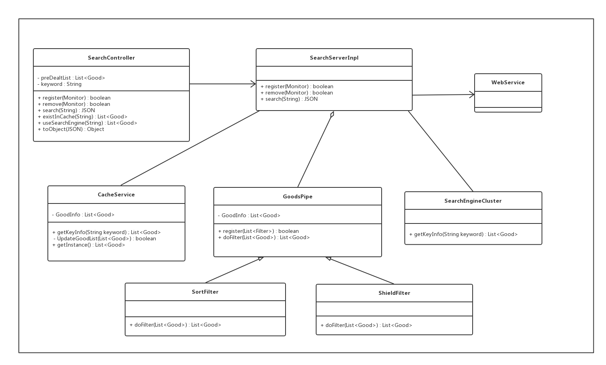
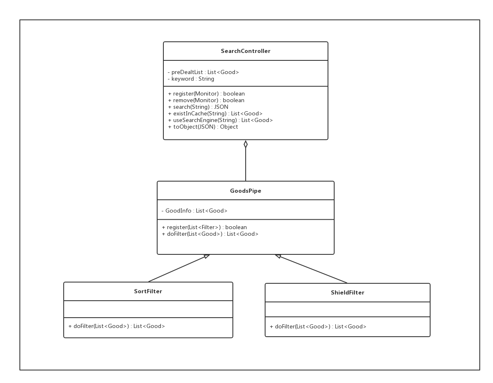

# 搜索服务模块

## 词汇表 ##

| 英文| 中文 | 备注  |
| :--- | :--- | :--- |
|cache |缓存| |
|pipe |管道| |
|filter |过滤器| |

## 一、概述
### 1.1 承担的需求（主要秘密）
搜索服务模块主要职责是处理搜索功能业务逻辑，在cache中没有找到的数据会通过搜索引擎查找，在通过pipe存到cache里返回

### 1.2 可能会修改的实现（次要秘密）
* 接口变更 
* 数据格式变化
* 排序算法变化
* 筛选算法变化

### 1.3涉及的相关质量属性 ###

* R1 数据可靠性
* R6 搜索易用性
* R9 保证存取效率

### 1.4 用例图

### 1.5 用例描述
1. 接收关键字：系统接收到用户输入的搜索关键词经过第一步格式处理后并传入searchServer

2. 搜索：系统根据获取的关键词从缓存和搜索引擎中获得信息

3. 缓存中查找：系统获得关键词现在缓存中查找信息是否已存在

4. 搜索引擎查找：系统获得的关键词在缓存中没有查找到相关信息则到搜索引擎中查找

5. 关键词处理：获得的商品信息需要进行排序、筛选的等操作

6. 返回搜索结果：将处理好的商品信息列表返回界面并显示

### 1.6 对外接口

**接口职责**

供FrontEnd模块调用获得用户输入

**接口方法**
* public JSON search(String key) ;
	* 职责：供FrontEnd模块调用获得用户输入	
	* 前置条件：数据已经格式化	
	* 后置条件：返回搜索结果，更新缓存模块
 
  
---
 
## 二、类的设计
### 2.1 类图

### 2.2 类描述

#### 2.2.1. SearchServerImpl 接口
**接口职责**
对外提供接口，获得用户输入内容与注册、移除监控器

#### 2.2.2. SearchController类
**类职责**

这些类是SearchServerImpl接口的具体实现类，实现了接口中申明的方法与自身的方法

**类方法：**

*  public  boolean register(Monitor monitor);
	* 职责：用于供监控器注册使用 
	* 前置条件：监控器已存在	
	* 后置条件：更新监控其信息
	
*  public  boolean remove(Monitor monitor);
	* 职责：用于移除监控器 
	* 前置条件：监控器已注册	
	* 后置条件：更新监控其信息

*  public  JSON search(String key);
	* 职责：用于获得用户输入	
	* 前置条件：		
	* 后置条件：无
	
*  public  List&lt<Good&lt> existInCache(String key);
	* 职责：查找是否已缓存改商品信息	
	* 前置条件：无		
	* 后置条件：无	
	
*  public  List&lt<Good&lt> useSearchEngine(String key);
	* 职责：查找搜索引擎获得相关商品列表	
	* 前置条件：在缓存中没找到商品信息		
	* 后置条件：更新缓存

*  public  Object toObject(JSON info);
	* 职责：将获得的信息格式转为Object
	* 前置条件：无		
	* 后置条件：无
	
#### 2.2.3. CacheService类
**类职责**

该类是用来处理缓存数据信息

**类方法：**

*  public  List&lt<Good&lt> getKeyInfo(String keyword);
	* 职责：由数据库获得相关商品信息列表
	* 前置条件：无	
	* 后置条件：无
	
*  public  boolean UpdateGoodList(List&lt<Good&lt> list);
	* 职责：由数据库获得相关商品信息列表
	* 前置条件：无	
	* 后置条件：更新缓存数据库信息
	
*  public  List&lt<Good&lt> getInstance();
	* 职责：获得缓存服务的实例	
	* 前置条件：无	
	* 后置条件：无

#### 2.2.4. GoodsPipe类
**类职责**

该类是用于传输商品信息的

**类方法：**

*  public  boolean register(List&lt<Filter&lt> filters);
	* 职责：用于一个或多个过滤器注册	
	* 前置条件：无	
	* 后置条件：无

*  public  List&lt<Good&lt> doFilter(List&lt<Good&lt> list);
	* 职责：传输数据信息给过滤器处理并获得处理好的数据
	* 前置条件：商品数据已被格式化	
	* 后置条件：无

#### 2.2.5. SortFilter类
**类职责**

该类为过滤器是用于排序算法，重新组织商品信息列表

**类方法：**

*  public  List&lt<Good&lt> doFilter(List&lt<Good&lt> list);
	* 职责：该过滤器按过滤算法对数据重新排序	
	* 前置条件：商品数据已被格式化	
	* 后置条件：无	

#### 2.2.5. ShieldFilter类
**类职责**

该类为过滤器是用于筛选算法，重新组织商品信息列表

**类方法：**

*  public  List&lt<Good&lt> doFilter(List&lt<Good&lt> list);
	* 职责：该过滤器按筛选算法对数据重新筛选	
	* 前置条件：商品数据已被格式化	
	* 后置条件：无

#### 2.2.6. SearchEngineCluster类
**类职责**

该类是搜索功能的主要数据来源中心，获得缓存中未找到的数据

**类方法：**

*  public  List&lt<Good&lt> getKeyInfo(String keyword);
	* 职责：该类用于获得未在缓存中找到的数据的商品信息列表
	* 前置条件：该数据未在缓存中找到信息	
	* 后置条件：更新缓存数据库
	
---	
	
## 三、重要协作
### 3.1 顺序图

---

## 四、设计模式应用
### 4.1 策略模式
> 策略模式(Strategy Pattern)作为一种软件设计模式，指对象有某个行为，但是在不同的场景中，该行为有不同的实现算法。-- wikipedia

**使用场景**

搜索过滤算法可能更改，因此此处可以使用策略模式

**策略模式在类图中的体现**

**要达到的效果**

便于更改过滤算法

### 4.2 单件模式
> 单例模式(Singleton pattern)，也叫单子模式，是一种常用的软件设计模式。在应用这个模式时，单例对象的类必须保证只有一个实例存在。许多时候整个系统只需要拥有一个的全局对象，这样有利于我们协调系统整体的行为。比如在某个服务器程序中，该服务器的配置信息存放在一个文件中，这些配置数据由一个单例对象统一读取，然后服务进程中的其他对象再通过这个单例对象获取这些配置信息。这种方式简化了在复杂环境下的配置管理。 --wikipedia

**使用场景**

系统中缓存对象保证仅有一个实例存在

**单件模式在类图中的体现**

**要达到的效果**

有利于协调系统行为，统一管理
