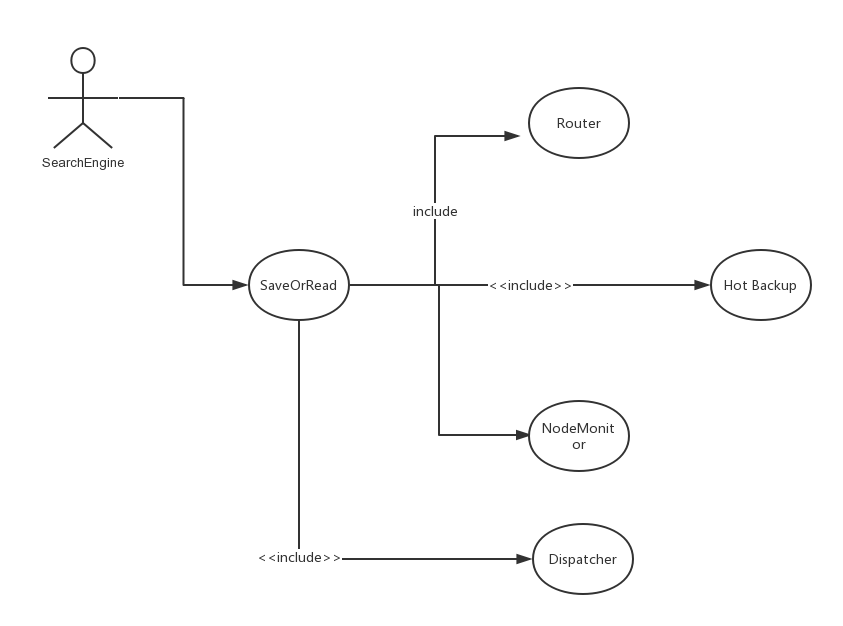
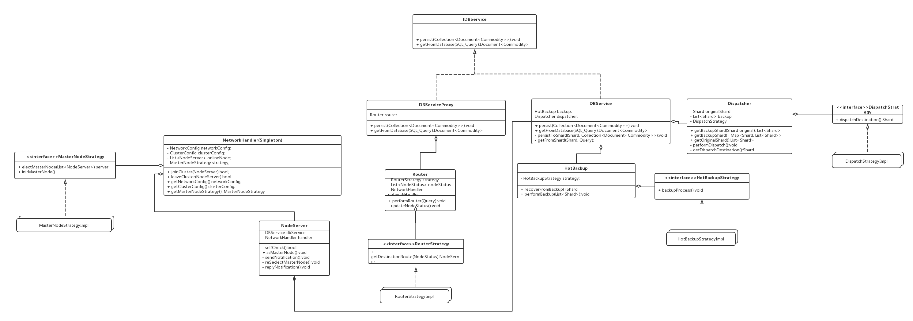
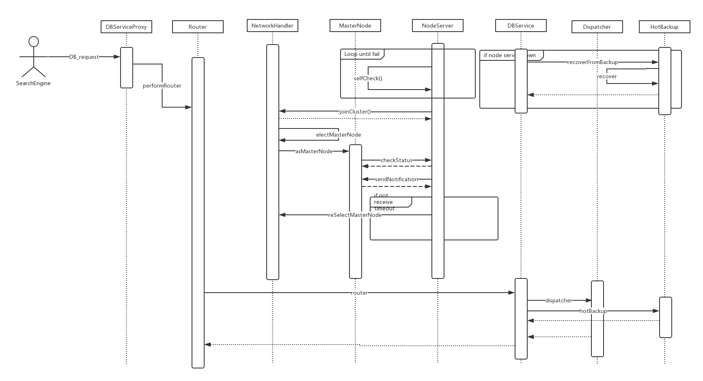
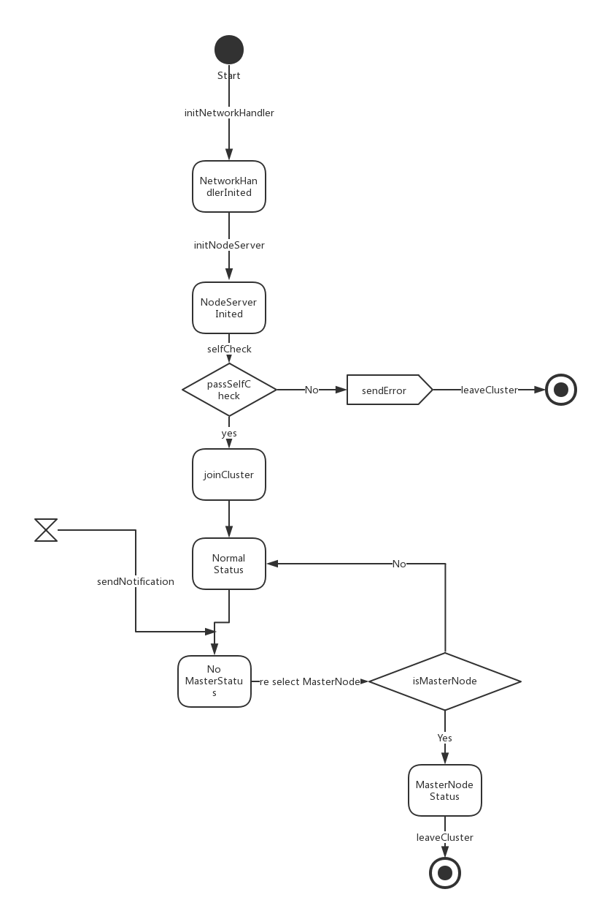
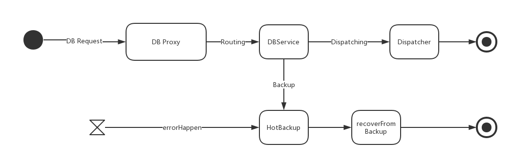
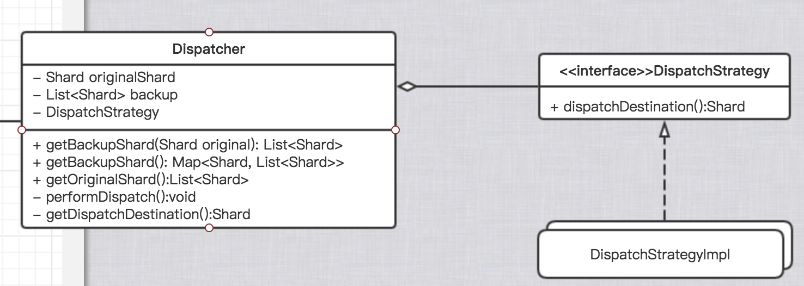
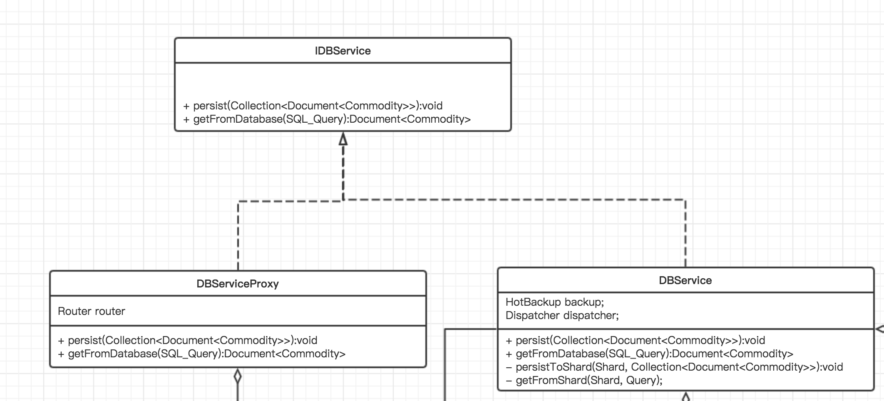

# SerachServerCluster 模块 #

## 词汇表 ##

| 英文| 中文 | 备注  |
| :--- | :--- | :--- |
|node  | （服务器）节点|
|cluster  |集群  |
|router  |路由| 转发请求到不同的服务器节点 |
|hotbackup  |热备份|
|Shard  |分片| 一份数据库可以有多个分片|
|Dispatcher| 分派器| 负责管理一个数据库节点的多个分片，以提高吞吐量 |

## 一、概述 ##
### 承担的需求（主要秘密） ###
SearchServerCluster模块负责设计搜索模块的服务器集群架构，以期实现高可靠性，高可用性和高并发性。

### 可能会修改的实现（次要秘密） ###
	
* 节点失效监测算法
* 服务器分片算法
* 服务器备份算法
* 服务器路由算法

### 涉及的相关质量属性 ###

* R1 数据可靠性
* R4 更新数据时系统可用
* R8 存储容量足够大
* R9 保证存取效率
* R10 高峰吞吐量

### 设计概述 ###
该模块是爱比价网的核心模块之一，与SearchEngine模块一同承担了存储和搜索的职责，但和SearchEngine模块主要描述了代码层次上的业务逻辑如何实现不同的是，SearchServerCluster模块主要描述了“部署视图”，考量的部分主要有以下几项：

* 中间件：如何使得SearchEngine的代码能够无缝的在各个服务器节点上运行
* 负载均衡：如何使得前端发来的存储和搜索请求能够被合适的分发到各个节点
* 高可靠性：如何使得部分数据库节点出错系统依然能够正常运行
* 高并发性：如何使得数据吞吐量尽可能最大
* 高可用性：如何保证在最短的时间内发现服务器的异常并修复

为了解决以上的问题，结合当前业界已有的一些解决方案，给出以下设计的主要思想：

* 统一对外接口，最小化接口，对其他模块屏蔽服务器集群的实现，表现出与单节点服务器类似的行为
* 采用路由机制，将请求分发到最近的服务器节点或者负载最小的服务器节点
* 采用热备份，一份数据在多个服务器节点上进行备份，备份服务器同样也可以提高吞吐量
* 采用分片机制，即不把一份数据库完整的存放在一个服务器节点上，以避免单节点的并发限制，同时也有助于路由机制和热备份的实现（此时存储单位较小，热备份可以以分片为单位而非整个节点为单位，提高热备份的效率）
* 采用节点监测，由一个节点作为主节点，定期监测其他节点是否正常工作；其他节点除了报告工作之外，也会接收主节点的信息，当主节点宕机时，其他节点立即重新选举出新的主节点以保证正常工作

### 用例图设计 ###

#### 用例图补充说明： ####
该模块中存在一个用户，SearchEngine模块，这个模块是爱比价网的一个模块，其DataService层需要调用本模块的读或写的服务来完成数据库的操作。其中SaveOrRead模块包含四个主要的部分，分别完成路由、热备份、节点监测，分片的功能。

### 角色 ###
* SaveOrRead: 允许读取或写入数据
* Router: 路由器，将请求分配到合适的节点
* HotBackup：负责热备份
* Dispatcher: 负责存储时将数据分到不同的shard中

### 模块对外接口 ###
1. Document\<Commodity\> **getFromDatabase**(SQL_Query);
	* 职责：从数据库中读取指定的Commodity文档
	* 前置条件：数据库节点工作正常
	* 后置条件：返回该Document
2. void **persist**(Collection\<Document\<Commodity\>\> commodities);
	* 职责：将一个Collection的商品文档写入到数据库中
	* 前置条件：数据库节点工作正常
	* 后置条件：数据库存储该文档并建立备份

## 二、类的设计 ##

### 2.1 类图 ###

### 2.2 类描述 ###
#### IDBService接口 ####
##### 接口职责 #####
IDBService为SearchServerCluster模块的核心类DBService和DBServiceProxy的接口，定义此接口是由于需对DBService采取代理模式，为了符合依赖倒转原则，建立了这个接口，它定义了这个模块对外界提供的接口--一个数据库最基本的功能：读和写，并封装了内部集群、负载均衡等复杂实现。

##### 接口方法 #####
* public void persist(Collection\<Document\<Commodity\>\>  commodities)
	* 职责：持久化数据
	* 前置条件：数据库自检通过，正常运行
	* 后置条件：持久化商品数据并生成备份
* public Document\<Commodity\> getFromDatabase(Query query)
	* 职责：从数据库中读取数据
	* 前置条件：数据库自检通过，正常运行
	* 后置条件：从数据库中返回相关数据

---

#### DBService类 ####
##### 类职责 #####
DBService类是IDBService接口的实现类，包含了持久化和读取数据的主要逻辑实现。它向上实现了IDBService的接口，持有HotBackup和Dispatcher，分别负责分片和热备份。Dispatcher负责封装数据库操作具体在哪个分片上执行，HotBackup负责在存储数据时进行热备份，并且当节点宕机后启动恢复过程

##### 类方法 #####
* public void persist(Collection\<Document\<Commodity\>\>  commodities)
	* 职责：持久化数据
	* 前置条件：数据库自检通过，正常运行
	* 后置条件：持久化商品数据并生成备份
* public Document\<Commodity\> getFromDatabase(Query query)
	* 职责：从数据库中读取数据
	* 前置条件：数据库自检通过，正常运行
	* 后置条件：从数据库中返回相关数据
* private void persistToShard(Shard shard, Collection\<Document\<Commodity\>\>  commodities)
	* 职责：持久化数据到某个分片上
	* 前置条件：数据库自检通过，正常运行
	* 后置条件：持久化商品数据到分片中并生成备份
* private Document\<Commodity\> getFromShard(Shard shard, Query query)
	* 职责：从数据库中读取数据
	* 前置条件：数据库自检通过，正常运行
	* 后置条件：在给定的分片中执行数据库操作

---

#### DBServiceProxy类 ####
##### 类职责 #####
DBServiceProxy是DBService的代理类，由于数据库服务是运行在多个服务器节点的，且极可能与提供外界接口的程序不在同一个服务器节点上，因此，我们需要一个代理类，用来代表其他节点上运行真正的DBService的实例。DBServiceProxy类持有Router的实例，用来将数据库请求转发到其他数据库节点上去。

##### 类方法 #####
* public void persist(Collection\<Document\<Commodity\>\>  commodities)
	* 职责：持久化数据
	* 前置条件：数据库自检通过，正常运行
	* 后置条件：持久化商品数据并生成备份
* public Document\<Commodity\> getFromDatabase(Query query)
	* 职责：从数据库中读取数据
	* 前置条件：数据库自检通过，正常运行
	* 后置条件：从数据库中返回相关数据
* private void sendToConcreteNode()
	* 职责：将数据库请求转发给真正的DBServic实例
	* 前置条件：router正常运行
	* 后置条件：完成转发操作

---

#### Router类 ####
##### 类职责 #####
router类负责解决服务器负载均衡问题，它接到请求后根据自身持有的服务器节点的状态以及请求本身的参数，判断请求该转发至何处。

##### 类方法 #####
* public void performRouter(Query) 
	* 职责：转发请求
	* 前置条件：数据库自检通过，正常运行
	* 后置条件：完成请求转发

* private void updateNodeStatus()
	* 职责：更新服务器节点的状态，以保证请求转发的时效性
	* 前置条件：数据库自检通过，正常运行
	* 后置条件：更新自身持有的服务器节点的状态
	
---

#### RouterStrategy接口 & RouterStrategyImpl类 ####
##### 接口&类职责 #####
为了能够更好地复用策略，更加符合开闭原则，避免未来可能的对算法的修改破坏原来类的封装性，于是将路由算法行为抽象成接口，并将实现放在策略类的具体实现类中。RouterStrategy可有多个实现类

##### 接口&类方法 #####
* public NodeServer getDestinationRoute(List\<NodeStatus\> nodeStatus)
	* 职责：根据目前服务器节点状况判断获取目标NodeServer
	* 前置条件：数据库自检通过，正常运行
	* 后置条件：返回该请求应当转发的目的地

---

#### HotBackup类 ####
##### 类职责 #####
HotBackup类负责热备份数据，恢复数据。当一个新的数据被存储时，HotBackup类需要向该服务器节点的备份shards写入数据。当服务器节点出现宕机后恢复时，DBService需要调用HotBackup的recoverFromBackup来恢复备份。

##### 类方法 #####
* public List\<Shard\> recoverFromBackup()
	* 职责：恢复该节点的原始分片（Original Shards）
	* 前置条件：数据库节点原始分配损坏或丢失且备份分片运作正常
	* 后置条件：从备份分片中恢复数据库及诶党的原始分片
* public void performBackup()
	* 职责：执行热备份
	* 前置条件：数据库节点所有原始分片和备份分片运作正常
	* 后置条件：完成从原始分片到备份分片的备份

---

#### HotBackupStrategy接口 & HotBackupStrategyImpl类 ####
##### 类职责 #####
为了能够更好地复用策略，更加符合开闭原则，避免未来可能的对算法的修改破坏原来类的封装性，于是将热备份算法行为抽象成接口，并将实现放在策略类的具体实现类中。HotBackupStrategy可有多个实现类

##### 类方法 #####
* public void backupProcess()
	* 职责：执行热备份的过程，具体有多种实现，分别实现在不同的HotBackupStrategyImpl类中
	* 前置条件：数据库节点所有原始分片和备份分片运作正常
	* 后置条件：完成从原始分片到备份分片的备份

---

#### Dispatcher类 ####
##### 类职责 #####
Dispatcher类负责封装一个服务器节点多个分片的实现，多分片机制避免了单节点数据库的最大并发限制，从而大大提高了最大并发量。Dispatcher持有一个数据库节点的分片和对应的备份分片。

##### 类方法 #####
* public Map\<Shard, List\<Shard\>\> getBackupShard()
	* 职责：获取节点所有原始分片到其备份节点的映射
	* 前置条件：数据库节点所有原始分片和备份分片运作正常
	* 后置条件：返回所有原始节点到其备份节点的映射
* public List\<Shard\> getBackupShard(Shard original)
	* 职责：获取给定原始分片到其备份节点的映射
	* 前置条件：该分片及其备份分片运作正常
	* 后置条件：返回该节点的所有备份节点
* public List\<Shard\> getOriginalShard()
	* 职责：获得该数据库节点的所有原始分片
	* 前置条件：数据库节点所有原始分片运作正常
	* 后置条件：返回该数据库节点的所有原始分片
* public void performDispatch()
	* 职责：执行分派的任务
	* 前置条件：数据库节点所有原始分片和备份分片运作正常
	* 后置条件：在某一分片上完成请求
* private Shard getDispatchDestination()
	* 职责：获得应当分配到的分片
	* 前置条件：数据库节点所有原始分片和备份分片运作正常
	* 后置条件：返回该请求应当分配到的分片
	
---

#### DispatchStrategy接口 & DispatchStrategyImpl类 ####
##### 类职责 #####
为了能够更好地复用策略，更加符合开闭原则，避免未来可能的对算法的修改破坏原来类的封装性，于是将分派算法行为抽象成接口，并将实现放在策略类的具体实现类中。DispatchStrategy可有多个实现类

##### 类方法 #####
* public Shard getDispatchDestination()
	* 职责：获得应当分配到的分片
	* 前置条件：数据库节点所有原始分片和备份分片运作正常
	* 后置条件：返回该请求应当分配到的分片

---

#### NetworkHandler类 ####
##### 类职责 #####
NetworkHandler类是全局网络配置类，它是单例的，持有网络配置和集群配置的引用，当一个节点加入和离开时，需要向它通知，其他节点也可以从该类获取当前服务器集群的运行状态。除此之外，它还持有如何选举出masterNode的方法，以及masterNode的初始化方法。当服务器集群第一次启动或masterNode宕机的时候，所有NodeServer需要获取选举masterNode的策略并自主推举masterNode，当成为MasterNode之后，需要调用该strategy的initMasterNode()方法。

##### 类方法 #####
* public bool joinCluster(NodeServer serverNode)
	* 职责：允许一个节点加入到集群中
	* 前置条件：该节点状态正常
	* 后置条件：将该节点加入到集群中
* public bool leaveCluster(NodeServer serverNode)
	* 职责：允许一个节点离开集群
	* 前置条件：该节点请求离开集群或该节点无响应时间超过阈值
	* 后置条件：将该节点移除集群
* public NetworkConfig getNetworkConfig()
	* 职责：获取全局网络配置
	* 前置条件：无
	* 后置条件：返回全局网络配置
* public ClusterConfig getClusterConfig()
	* 职责：获取服务器集群配置
	* 前置条件：无
	* 后置条件：返回服务器集群配置
* public MasterNodeStrategy getMasterNodeStrategy()
	* 职责：获取MasterNodeStrategy
	* 前置条件：无
	* 后置条件：返回MasterNodeStrategy

---

#### NodeServer类 ####
##### 类职责 #####
NodeServer类代表了服务器集群上的每一个节点，与DBService是在每一个节点上运行数据库服务不同，NodeServer主要处理集群、自检等问题，以保证集群的正常运作。
NodeServer会定期发送通知到MasterNode，如果masterNode无响应的时间超过了一定阈值，NodeServer会向其它NodeServer发通知，来判定MasterNode是否出现了不可预计的错误而无法正常运行。若如此，将选举新的MasterNode，成为masterNode的NodeServer将调用NetworkHandler的initAsMasterNode的方法，承担作为MasterNode的职责。

##### 类方法 #####
* private bool selfCheck()
	* 职责：节点自我检查，服务器节点需要定期进行自我检查，当出现故障时需要通知NetworkHandler和MasterNode
	* 前置条件：无
	* 后置条件：服务器节点状态更新
* public void asMasterNode()
	* 职责：执行作为MasterNode的行为
	* 前置条件：该节点被选择为MasterNode
	* 后置条件：执行MasterNode的行为
* private void sendNotification()
	* 职责：向MasterNode发送消息
	* 前置条件：无
	* 后置条件：发送自己状态的消息
* private void reSelectMasterNode()
	* 职责：当MasterNode宕机时，发起重新选择MasterNode的全网通知
	* 前置条件：MasterNode无响应时间超过了一定阈值
	* 后置条件：向其他节点发送通知重新选举MasterNode
* private void replyNotification()
	* 职责：回复其他节点的消息
	* 前置条件：收到其他节点发来的消息
	* 后置条件：根据自身状态发送回复消息

---

#### MasterNodeStrategy接口 & MasterNodeStrategyImpl类 ####
##### 类职责 #####
由于MasterNode选举策略和行为属于容易改变的部分，因而单独封装成一个接口，使用策略模式，以保证MasterNodeStrategy行为的变化不会影响原有的代码啊，更好的符合开闭原则。

##### 类方法 #####
* public NodeServer electMasterNode(List\<NodeServer\> servers)
	* 职责：选举新的MasterNdoe
	* 前置条件：当前服务器集群无MasterNode
	* 后置条件：返回下一个应当成为masterNode的节点

* public void initAsMasterNode()
	* 职责：初始化masterNode，赋予成为masterNode的NodeServer以定期检查其他节点的行为
	* 前置条件：初始化masterNode
	* 后置条件：完成masterNode初始化

## 三、重要协作 ##
### 顺序图 ###

### 状态图 ###

#### 集群工作状态转移 ####

#### 路由与分片状态 ####

## 四、设计模式应用 ##

### **策略模式** ###

>策略模式(Strategy Pattern)作为一种软件设计模式，指对象有某个行为，但是在不同的场景中，该行为有不同的实现算法。-- wikipedia

在SearchServerCluster模块中，由于外界因素的不确定性，且随着需求的变化，部分算法的具体实现细节可能会不断地变化，为了符合开闭原则，应当避免在修改搜索策略时破坏已有代码的封装，为此，SearchServerCluster模块中大量使用了策略模式，将易于变化的部分独立出来，声明一个策略接口，含有算法的接口，并将实现存放于具体的策略实现子类，实现了将算法的具体实现推迟到了运行时的绑定，使得修改策略仅需要实现一个新的策略实现子类即可，并调用setStrategy()方法修改策略即可，从而保证了高内聚和低耦合。

#### 类图体现 ####

策略模式在类图中多处有体现，这里不一一赘述，只举一例说明。

---
### **代理模式** ###

> 代理模式 (Proxy Pattern) 是程序设计中的一种设计模式。
所谓的代理者是指一个类别可以作为其它东西的接口。代理者可以作任何东西的接口：网络连接、存储器中的大对象、文件或其它昂贵或无法复制的资源。 --wikipedia

使用代理模式可以创造代表对象，让代表对象控制对某对象的访问，被代理的对象可以是远程的对象，创建开销大的对象，或者需要安全控制的对象。使用代理模式处于以下考量：

* 本系统中，DataService类似对数据库的核心访问类，会在多个数据库节点上提供对数据库的访问，有可能不与Proxy类在同一个服务器节点上,Proxy类持有的router可以进行请求转发，将代理类接收到的请求转发给不同的节点
* 出于数据安全的重要性，需要保证这个类不会被外界的恶意指令所干扰，Proxy类可以做安全检查和拦截，避免外界指令直接访问数据库核心类

因此，本模块中对DataService类使用代理模式

#### 类图体现 ####

---

### **单例模式** ###

>单例模式(Singleton pattern)，也叫单子模式，是一种常用的软件设计模式。在应用这个模式时，单例对象的类必须保证只有一个实例存在。许多时候整个系统只需要拥有一个的全局对象，这样有利于我们协调系统整体的行为。比如在某个服务器程序中，该服务器的配置信息存放在一个文件中，这些配置数据由一个单例对象统一读取，然后服务进程中的其他对象再通过这个单例对象获取这些配置信息。这种方式简化了在复杂环境下的配置管理。 --wikipedia

本模块中网络的配置和集群的状态由NetworkHandler统一管理，为了简化配置管理，保证全局配置的统一性，使用单例模式管理NetworkHandler

#### 类图体现 ####

