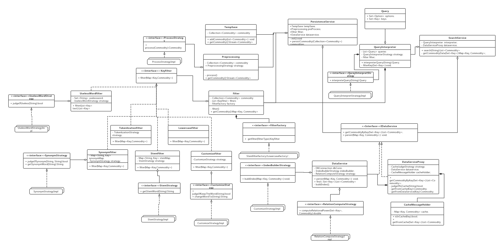

# SerachEngine 模块 #

## 词汇表 ##

| 英文| 中文 | 备注  |
| :--- | :--- | :--- |
|141250017  |陈自强 `PM`|
|131130137  |董本超  |
|141250026  |狄逸枫|
|141250031  |杜天蛟|
|141250033  |段正谋|
|141250035  |范炜|
|141250042  |韩梦虞|
|141250043  |韩奇|
|141250106  |申彬|
|141250110  |侍硕|

## 一、概述 ##
### 承担的需求（主要秘密） ###
搜索引擎模块主要负责将爬虫获取的数据存储到数据库中并提供给前端一个高效可用的搜索接口。

其需要考虑的核心问题为：如何组织数据使得搜索变得高效。这个问题是由于搜索是系统的核心功能，相比于存储而言，搜索发生的频率会**更高且更集中**。由于商品的数据是**非结构化**数据，为了实现高效搜索，以保证服务器的**高可靠性和高可用性**，我们应当需要在数据存储的时候为它们建立适当的索引，并优化搜索结构，使得搜索能够快速高效的进行。为了实现以上设想，提出了以下存储流程设计：

1. 在存储数据的之前，首先对数据进行**预处理**。例如额外增加一个域：数据增加时间。这个域有以下用途：
	* 用于未来搜索可能的过滤条件，如仅仅返回特定时间之后的数据
	* 作为判定数据相关性权重的一个判定标准。顾客搜索商品肯定不太愿意搜索到过时的商品，因此时间较为久远的商品在计算相关性时应当较低 

2. 存储数据时，**分域存储**，如标题，描述，价格，图片，链接等。分域存储有以下考虑：
	* 使非结构化的商品信息部分变得结构化，便于搜索
	* 使得搜索时可以以某些域作为过滤的条件（如价格）
	* 每个域可以有不同的权重值作为
	
3. 商品存储完成之后，为其建立索引，用于现时段搜索主要是基于关键字搜索，因此索引也基于关键字建立。然而在建立关键字索引时有以下问题考虑：
	* 无效关键字：中文如“的” “你” “我”， 英文如"this", "that"等
	* 同义词如 华为,“huawei”， “tf卡”&“手机存储卡”
	* 同根词:主要是英文网站中的词汇，如 "created"&"creation"
	* 不同词汇优先级不同，如搜索华为手机，则华为二字的优先级相比手机更高（因其频率较低）
	* 不同关键字访问频率不同，有些商品会被频繁访问
	
	**补充标签的**
	为了解决以上问题，我们需要一系列的处理流程来建立索引：
	
	* Tokenlization:序列化，移除标点符号，移除无效关键字
	* Normalization:token标准化，用一系列的filter来处理
		* Lowercase Filter: 全部转化为小写（针对英文）
		* Synonym Filter: 同义词用一个代替
		* Stem Filter: 转为为词干（中文则去除无效的介词等等）
	* Cache: 若包含高频关键字，将该商品信息纳入缓存中
	
	除了存储爬虫获取的信息外，本模块另一个重要的功能就是提供高效快速地检索，既然数据已经被有条理的存储在了数据库中，那么我们就应当合理的去利用这些已经优化过了的数据。因此，提出以下搜索的流程：
	1. 同存储一样，搜索的关键字也需要进行**过滤器处理**，以使得关键词与数据库中的索引的关键词一致。因此filter必须要保持一致，才能确保检索时有效的（工厂模式）
	2. 经过filter处理之后获得关键字，优先在高频检索结果中（缓存）查找，之后根据设定的优先级算法，在数据库中查找，返回指定的高优先级的结果
	3. 将查找过得结果发送到排序模块（默认按相关性返回，但是允许修改排序算法），之后返回
	
	这就是整个Search Engine模块的整体思想，下面通过用例图进行说明。
	

### 用例图设计 ###

#### 用例图补充说明： ####
该用例图表明了系统中存在两个外界用户，一个是前端调用搜索接口的程序，及需要存储数据的爬虫。

##### 存储模块 #####
* 当爬虫发送数据过来的时候，由于一次可能发送大量数据，因此需要先有缓存模块(TempSave)，暂时存放数据，并以流式方式提供给预处理模块(Preprocessing)
* 预处理模块执行商品信息结构化及分域存储，增加额外信息域等工作
* 过滤器模块执行商品正文信息索引建立的处理工作，抽取出核心关键词
* DAO模块负责存储数据
* 索引建立器模块负责建立索引

##### 搜索模块 #####
* 首先由查询解释器（Query Interpreter）进行查询语言解析
* 对需要查询的文本，进行filter过滤，提取出与索引一致的关键字
* 根据关键字，由Cache Judege模块判定是否有缓存，若有查找缓存中对应数据，否则根据索引查找器进行查找

### 可能会修改的实现（次要秘密） ###
	
* 商品信息预处理算法
* 分域存储算法
* 无效关键字检测算法
* 同义词匹配算法
* 同根词匹配算法
* 词汇优先级算法
* 高频访问缓存算法

### 角色 ###
* Front Service: 调用搜索服务者
* Data Provider: 提供商品数据
* Search Service：搜索服务总模块，提供搜索服务
	* Query Interpreter: 查询解释器，解释用户查询语言，从中分解出查询条件
	* Filter：过滤模块，负责将关键字Token化，标准化，以提高搜索命中率和搜索速度
		* Tokenlization： 将非结构化文本变为Token流
		* Normalization： 将Token正则化
				 	  
	* CacheJudge：判定是否搜索的关键字是否在缓存中
	* Cache：缓存模块
	* IndexSearcher：索引搜索模块，根据索引寻找搜索结果
	* Sort：排序模块
* Persistence Service：商品信息持久化总模块，提供存储商品信息服务
	* TempSave：暂时存储Data Provider传来的数据，并以流式方式进行存储
	* Preprocessing：预处理模块，执行商品信息结构化及分域存储，增加额外信息域等工作
	* Filter模块：同SearchService中Filter模块的描述
	* DAO：数据库持久化相关模块，负责存储数据并建立索引
	* Index Builder：根据已经生成的关键字流建立索引

### 模块对外接口 ###
1. Collection\<CommodityInfo\> **search**(String message, Collection\<Option\> Options);
2. void **persist**(Collection\<CommodityInfo\> commodities);

## 二、类的设计 ##

### 2.1 类图 ###

### 2.2 类描述 ###
#### PersistenceService类 ####
##### 类职责 #####
本类为SearchEngine模块的核心类之一，为存储模块的核心控制器，存储模块采用的设计风格为主程序-子程序风格，而PersistenceService类内持有TempSave、Preprocessing等类的引用，并封装了存储的逻辑。

##### 类方法 #####
* private void init(): 初始化组件，检查数据库连通性
* public void persistCommodity(Collection<Commodity>); 核心对外接口，提供持久化商品的接口
* 

#### TempSave类 ####
##### 类职责 #####
##### 类方法 #####

#### PreProcessing类 ####
##### 类职责 #####
##### 类方法 #####

#### Filter类 ####
##### 类职责 #####
##### 类方法 #####
#### KeyFilter接口 ####
##### 接口职责 #####
##### 接口方法 #####
#### TokenlizationFilter类 ####
##### 类职责 #####
##### 类方法 #####
#### LowercaseFilter类 ####
##### 类职责 #####
##### 类方法 #####
#### SynonymFilter类 ####
##### 类职责 #####
##### 类方法 #####
#### StemFilter类 ####
##### 类职责 #####
##### 类方法 #####
#### CustomizeFilter类 ####
##### 类职责 #####
##### 类方法 #####
#### FilteFactory类 ####
##### 类职责 #####
##### 类方法 #####
#### *FilterStrategy接口 ####
##### 类职责 #####
##### 类方法 #####
#### *FilterStrategyImpl类 ####
##### 类职责 #####
##### 类方法 #####
#### DataService类 ####
##### 类职责 #####
##### 类方法 #####
#### SearchService类 ####
##### 类职责 #####
##### 类方法 #####
#### QueryInterpreter类 ####
##### 类职责 #####
##### 类方法 #####
#### DataServiceProxy类 ####
##### 类职责 #####
##### 类方法 #####
#### CacheJudgeStrategy接口 ####
##### 类职责 #####
##### 类方法 #####
#### CacheMessageHolder类 ####
##### 类职责 #####
##### 类方法 #####

## 三、重要协作 ##
### 顺序图 ###

### 状态图 ###

## 四、设计模式应用 ##

### XXX设计模式 ###

