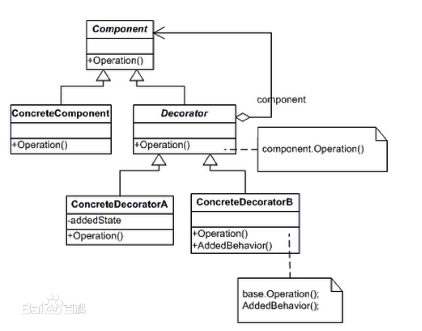

# ShieldFilter 模块

## 一、概述

### 承担的需求（主要秘密）
职责：
查找GoodsPipe传入的商品列表中存在的需要屏蔽的商品进行监测和屏蔽。
秘密：
要对于屏蔽商品的规则进行隐藏

### 可能会修改的实现（次要秘密）

商品过滤可能会有多种附加规则，比如：
* 规则1:	按照商品名称中的关键字进行过滤，比如存在毒品、武器、无证产品、假货等字样需要进行屏蔽；
* 规则2: 	可以按照商品的来源进行屏蔽，比如近期某商城提供的产品可能存在问题，需要根据其来源进行屏蔽。
* 规则3:	可以使用管理员自定义的屏蔽规则，管理员可以从商品列表中选择需要屏蔽的产品；
以上规则可能会需要一种或多种的排列组合（比如先用规则1 筛选再用规则2筛选的结果与先用规则2再使用规则1筛选的结果是不同的）

### 涉及的相关质量属性

* R1 数据可靠性
* R6 搜索易用性

### 模块对外接口

1. public List`<`GoodsInfo`>`  doFilter（List`<`GoodsInfo`>` list）{ } ;

## 二、类的设计

### 2.1 类图

### 2.2 类描述

#### IFilter类

##### 类职责

本类为过滤器接口

##### 类方法

* List`<`GoodInfo`>` doFilter\(List`<`GoodInfo`>`\): 
  * 职责：定义接口
  * 前置条件：无
  * 后置条件：无

---

#### ShieldFilter类
##### 类职责

本类的职责是执行特定商品信息屏蔽

##### 类方法

* List`<`GoodInfo`>` doFilter\(List`<`GoodInfo`>`\): 
  * 职责：定义接口
  * 前置条件：管道中有待过滤的数据
  * 后置条件：无

---

#### Decorator类

##### 类职责

装饰者

##### 类方法

* Decorator（IFilter）

  * 职责：构造函数
  * 前置条件：IFilter实例被创建
  * 后置条件：私有成员IFilter指向SortFilter实例

* List`<`GoodInfo`>` doFilter\(List`<`GoodInfo`>`\):

  * 职责：根据商品屏蔽规则进行过滤
  * 前置条件：管道中有需过滤的商品信息；Decorator被初始化
  * 后置条件：按照系统的过滤规则从列表中删除非法商品信息

---

#### WebsiteSortFilter类

##### 类职责

对商品列表中的商品信息按照其来源网站的优先级由高到低排序

##### 类方法

* KeyWordShieldFilter（IFilter）

  * 职责：构造函数
  * 前置条件：IFilter实例被创建
  * 后置条件：Decorator被初始化

* List`<`GoodInfo`>` doFilter\(List`<`GoodInfo`>`\):

  * 职责：根据商品屏蔽规则进行过滤
  * 前置条件：管道中有需过滤的商品信息；
  * 后置条件：商品列表中的非法商品信息被删除

* List`<`GoodInfo`>` shieldByKeyWord \(List`<`GoodInfo`>`\): 
  * 职责：根据商品关键字屏蔽规则进行过滤
  * 前置条件：管道中有需过滤的商品信息；
  * 后置条件：商品列表中商品名带有敏感词的商品信息被屏蔽

---

#### SourceSiteShieldFilter类
##### 类职责

屏蔽商品列表中来自不符合规定的网站的商品信息
##### 类方法

* SourceSiteShieldFilter（IFilter）

  * 职责：构造函数
  * 前置条件：IFilter实例被创建
  * 后置条件：Decorator被初始化

* List`<`GoodInfo`>` doFilter\(List`<`GoodInfo`>`\):

  * 职责：屏蔽商品列表中来自不符合规定的网站的商品信息
  * 前置条件：无；
  * 后置条件：屏蔽商品列表中来自不符合规定的网站的商品信息

* List`<`GoodInfo`>` shieldBySourceSite \(List`<`GoodInfo`>`\): 
  * 职责：屏蔽商品列表中来自不符合规定的网站的商品信息
  * 前置条件：管道中有需过滤的商品信息；
  * 后置条件：商品列表中来自不符合规定的网站的商品信息被删除
---

#### AdminShieldFilter类
##### 类职责
屏蔽商品列表中不符合管理员要求的商品信息

##### 类方法

* AdminShieldFilter（IFilter）

  * 职责：构造函数
  * 前置条件：IFilter实例被创建
  * 后置条件：Decorator被初始化

* List`<`GoodInfo`>` doFilter\(List`<`GoodInfo`>`\):

  * 职责：屏蔽商品列表中不符合管理员要求的商品信息
  * 前置条件：无；
  * 后置条件：商品列表中不符合管理员要求的商品信息被屏蔽

* List`<`GoodInfo`>` shieldByAdmin \(List`<`GoodInfo`>`\): 
  * 职责：屏蔽商品列表中不符合管理员要求的商品信息
  * 前置条件：管道中有需过滤的商品信息；
  * 后置条件：商品列表中不符合管理员要求的商品信息被屏蔽

---

## 三、重要协作

### 顺序图

---

#### 协作描述
1.	搜索服务根据系统要求的商品信息屏蔽规则创建过滤器
2.	搜索服务创建管道
3.	搜索服务向管道注册过滤器
4.	搜索服务请求管道对商品信息列表进行过滤
5.	管道依次请求向自己注册的过滤器对商品信息列表进行过滤
6.	屏蔽过滤器根据系统规则对商品信息列表进行过滤，返回满足屏蔽规则的数据
7.	管道返回排序完毕的数据给搜索服务器

---

## 四、设计模式应用

### 装饰者模式

#### 使用场景：
用户请求对搜索商品的结果进行排序显示
#### 效果：
非法商品屏蔽服务可以选择使用三种排序规则中的一种或多种，也可以选择使用不同屏蔽规则的先后顺序。还可以在不改变原代码的基础上，实现新增非法商品筛选规则（只要继承Decorator类即可）。可扩展性良好。

