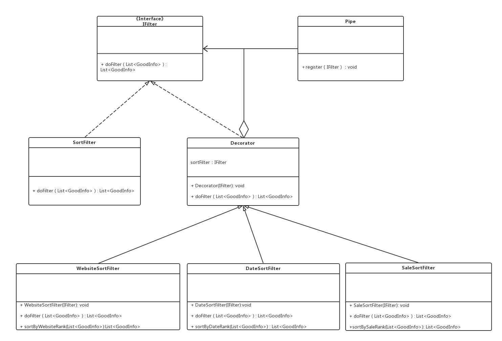
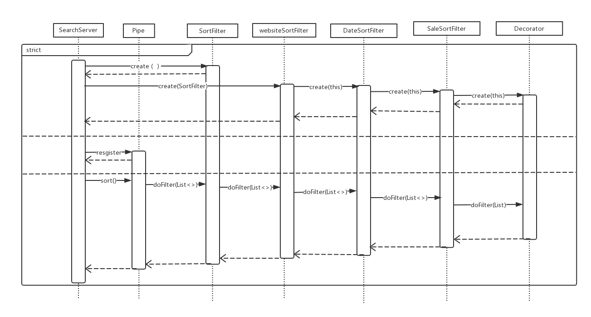
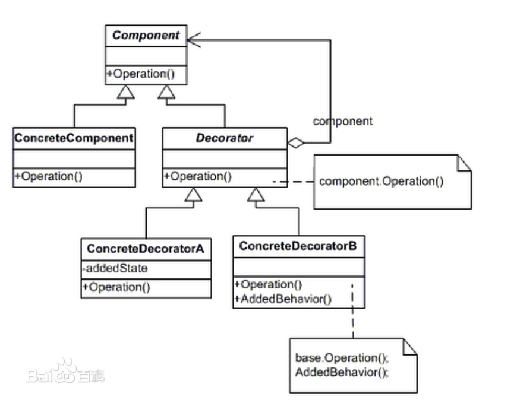

# SerachEngine 模块

## 词汇表

| 英文 | 中文 | 备注 |
| :--- | :--- | :--- |
| Tokenlization | 序列化 |  |
|  | Normalization | 标准化 |
| Front Service | 前端服务 | 前端是相对而言的 |
| Data Provider | 数据提供者 | 如爬虫 |

## 一、概述

### 承担的需求（主要秘密）

对GoodsPipe传入的商品列表按照竞价规则进行排序,要对于竞价排名的规则进行隐藏

### 可能会修改的实现（次要秘密）

商品竞价排名可能会有多种附加规则，比如：

* 规则1:按照合作网站的先后顺序排序；
* 规则2: 按照商品发布的日期和时间；
* 规则3:按照商品的销售量。

以上规则可能会需要一种或多种的排列组合（比如先用规则1 筛选再用规则2筛选的结果与先用规则2再使用规则1筛选的结果是不同的）

### 涉及的相关质量属性

* R1 数据可靠性
* R6 搜索易用性

### 模块对外接口

1. public List`<`GoodsInfo`>`  doFilter（List`<`GoodsInfo`>` list）{ } ;

## 二、类的设计

### 2.1 类图

### 2.2 类描述

#### IFilter类

##### 类职责

本类为过滤器接口

##### 类方法

* List`<`GoodInfo`>` doFilter\(List`<`GoodInfo`>`\): 
  * 职责：定义接口
  * 前置条件：无
  * 后置条件：无

---

#### SortFilter类

##### 类职责

本类的职责是执行竞价排名操作

##### 类方法

* List`<`GoodInfo`>` doFilter\(List`<`GoodInfo`>`\): 
  * 职责：定义接口
  * 前置条件：管道中有待排序的数据
  * 后置条件：无

---

#### Decorator类

##### 类职责

装饰者

##### 类方法

* Decorator（IFilter）

  * 职责：构造函数
  * 前置条件：IFilter实例被创建
  * 后置条件：私有成员IFilter指向SortFilter实例

* List`<`GoodInfo`>` doFilter\(List`<`GoodInfo`>`\):

  * 职责：根据竞价排名规则进行过滤
  * 前置条件：管道中有需过滤的商品信息；
  * 后置条件：商品列表中的商品信息按照客户要求的排序规则排列

---

#### WebsiteSortFilter类

##### 类职责

对商品列表中的商品信息按照其来源网站的优先级由高到低排序

##### 类方法

* WebsiteSortFilter（IFilter）

  * 职责：构造函数
  * 前置条件：IFilter实例被创建
  * 后置条件：Decorator被初始化

* List`<`GoodInfo`>` doFilter\(List`<`GoodInfo`>`\):

  * 职责：根据竞价排名规则进行过滤
  * 前置条件：管道中有需过滤的商品信息；
  * 后置条件：商品列表中的商品信息按照客户要求的排序规则排列

* List`<`GoodInfo`>` sortByWebsiteRank\(List`<`GoodInfo`>`\): 
  * 职责：根据竞价排名规则进行过滤
  * 前置条件：管道中有需过滤的商品信息；
  * 后置条件：商品列表中的商品信息按照客户要求的排序规则排列

---

#### DateSortFilter类

##### 类职责

商品列表中的商品信息按照其发布日期由最近发布到最早发布排序

##### 类方法

* DateSortFilter（IFilter）

  * 职责：构造函数
  * 前置条件：IFilter实例被创建
  * 后置条件：Decorator被初始化

* List`<`GoodInfo`>` doFilter\(List`<`GoodInfo`>`\):

  * 职责：根据竞价排名规则进行过滤
  * 前置条件：无；
  * 后置条件：商品列表中的商品信息按照其发布日期由最近发布到最早发布排序

* List`<`GoodInfo`>` sortByDateRank\(List`<`GoodInfo`>`\): 
  * 职责：根据竞价排名规则进行过滤
  * 前置条件：管道中有需过滤的商品信息；
  * 后置条件：商品列表中的商品信息按照其发布日期由最近发布到最早发布排序

---

#### SaleSortFilter类

##### 类职责

商品列表中的商品信息按照其销售量由最高到最低排序

##### 类方法

* SaleSortFilter（IFilter）

  * 职责：构造函数
  * 前置条件：IFilter实例被创建
  * 后置条件：Decorator被初始化

* List`<`GoodInfo`>` doFilter\(List`<`GoodInfo`>`\):

  * 职责：根据竞价排名规则进行过滤
  * 前置条件：无；
  * 后置条件：商品列表中的商品信息按照其销售量由最高到最低排序

* List`<`GoodInfo`>` sortBySaleRank\(List`<`GoodInfo`>`\): 
  * 职责：根据竞价排名规则进行过滤
  * 前置条件：管道中有需过滤的商品信息；
  * 后置条件：商品列表中的商品信息按照其销售量由最高到最低排序

---

## 三、重要协作

### 顺序图

---

#### 协作描述
1.	搜索服务根据用户要求的排序规则创建过滤器
2.	搜索服务创建管道
3.	搜索服务向管道注册过滤器
4.	搜索服务请求管道对商品信息列表进行过滤
5.	管道依次请求向自己注册的过滤器对商品信息列表进行过滤
6.	过滤器根据用户定义的规则对商品信息列表进行排序，返回排序完毕的数据
7.	管道返回排序完毕的数据给搜索服务器

---

## 四、设计模式应用

### 装饰者模式

