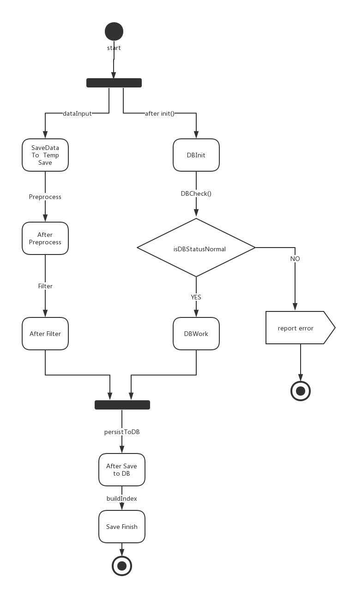
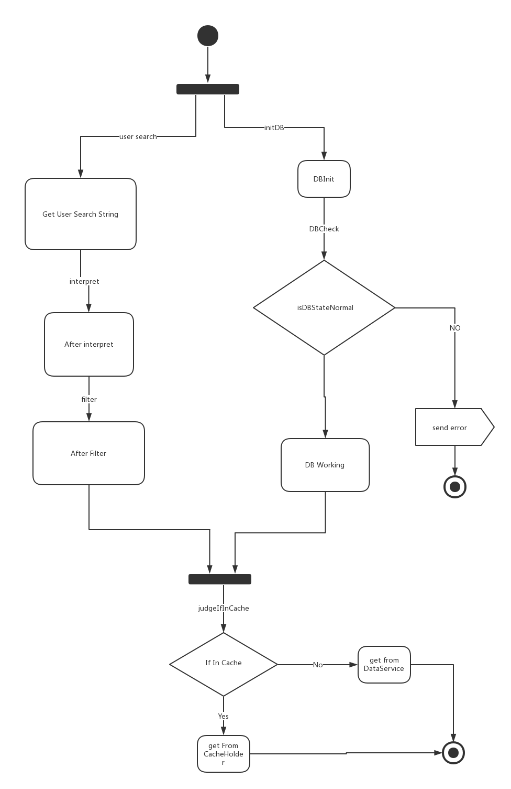

# SerachEngine 模块 #

## 词汇表 ##

| 英文| 中文 | 备注  |
| :--- | :--- | :--- |
| Tokenlization  |序列化| |
| Normalization  |标准化  |
|Front Service|前端服务| 前端是相对而言的|
|Data Provider| 数据提供者 | 如爬虫|

## 一、概述 ##
### 承担的需求（主要秘密） ###
对GoodsPipe传入的商品列表按照竞价规则进行排序,要对于竞价排名的规则进行隐藏

### 可能会修改的实现（次要秘密） ###
	
商品竞价排名可能会有多种附加规则，比如：
* 规则1:按照合作网站的先后顺序排序；
* 规则2: 按照商品发布的日期和时间；
* 规则3:按照商品的销售量。

以上规则可能会需要一种或多种的排列组合（比如先用规则1 筛选再用规则2筛选的结果与先用规则2再使用规则1筛选的结果是不同的）
### 涉及的相关质量属性 ###

* R1 数据可靠性
* R6 搜索易用性

### 模块对外接口 ###
1. public List`<`GoodsInfo`>`  doFilter（List`<`GoodsInfo`>` list）{ } ;

## 二、类的设计 ##

### 2.1 类图 ###

### 2.2 类描述 ###
#### IFilter类 ####
##### 类职责 #####
本类为过滤器接口
##### 类方法 #####
* List`<`GoodInfo`>` doFilter(List`<`GoodInfo`>`): 
	* 职责：定义接口
	* 前置条件：无
	* 后置条件：无
---
#### SortFilter类 ####
##### 类职责 #####
本类的职责是暂时存储DataProvider传过来的大量数据，并以流的方式提供商品的数据。

##### 类方法 #####
* List`<`GoodInfo`>` doFilter(List`<`GoodInfo`>`): 
	* 职责：定义接口
	* 前置条件：管道中有待排序的数据
	* 后置条件：无

* public void getCommodity():Stream\<Commodity\>
	* 职责：返回缓存池里未持久化的信息
	* 前置条件：类初始化完成
	* 后置条件：返回未持久化的商品信息

---

#### PreProcessing类 ####
##### 类职责 #####
本类的职责主要是预处理Commodity，并将预处理过后的Commodity信息以流的形式返回。
可能的预处理逻辑包括增加域，修改域的信息，如将字符串时间转化为时间戳等
预处理的逻辑可能变化，因此采用策略模式，将具体的预处理逻辑放在PreProcessStrategy中

##### 类方法 #####
* public void getCommodity():Stream\<Commodity\>
	* 职责：返回预处理后的信息
	* 前置条件：从TempSave类处获取数据
	* 后置条件：返回预处理后的商品信息流

* private void process()
	* 职责：预处理信息，调用PreProcessStrategy实现
	* 前置条件：预处理策略已设置
	* 后置条件：完成预处理

---

#### Filter类 ####
##### 类职责 #####
Filter类是建立索引的关键类，它持有一系列的过滤器，逐个执行，以实现从文本信息这种非结构数据中抽取出有效的关键字，利于后期建立索引。并返回一个Map，包含关键字和其商品信息。

##### 类方法 #####
* private void initFilter();
	* 职责：通过调用FilterFactory生成一系列的Filter实例
	* 前置条件：无
	* 后置条件：完成filter的初始化

* private void filter();
	* 职责：循环调用持有的所有Filter
	* 前置条件：无
	* 后置条件：完成过滤

* public Map<Key, Commodity> getCommodity();
	* 职责：返回经过过滤的商品信息键值对
	* 前置条件：商品信息过滤完成
	* 后置条件：返回经过过滤的商品信息键值对

---

#### KeyFilter接口 ####
##### 接口职责 #####
KeyFilter接口定义了所有关键字Filter类必须实现的接口，便于Filter类统一调度

##### 接口方法 #####
* public Map<Key, Commodity> filter(Map\<Key, Commodity\>);
	* 职责：按照类的策略对商品关键字进行过滤
	* 前置条件：商品信息已经经过预处理
	* 后置条件：返回经过当前类过滤的商品

---

#### TokenlizationFilter类 ####
##### 类职责 #####
将商品信息变成Token流，方便之后的filter进行处理

##### 类方法 #####
同KeyFilter接口方法描述

---

#### LowercaseFilter类 ####
##### 类职责 #####
将Token（Key）全部小写化处理

##### 类方法 #####
同KeyFilter接口方法描述

---

#### SynonymFilter类 ####
##### 类职责 #####
维护一个同义词的Map，该Map存储了关键字的等价类表示，将关键词替换为等价的类

##### 类方法 #####
同KeyFilter接口方法描述

---

#### StemFilter类 ####
##### 类职责 #####
维护一个包含词到词干映射的Map，将关键词转化为其词干

##### 类方法 #####
同KeyFilter接口方法描述

---

#### CustomizeFilter类 ####
##### 类职责 #####
允许赞助商（或其他用户）按照他们想要的方式去存储数据，以便以特定的方式被检索出来，这个类是为了预留可能的新的过滤模块而设计的，可能有多个实现子类。

##### 类方法 #####
同KeyFilter接口方法描述

---

#### FilteFactory类 ####
##### 类职责 #####
负责封装具体Filter类的创建代码，以降低Filter和具体Filter类间的耦合

##### 类方法 #####
* Filter getFilter(FilterType type);
	* 职责：生成并返回指定类型的Filter
	* 前置条件：无
	* 后置条件：返回指定类型的Filter

---

#### \*FilterStrategy接口 ####

##### 类职责 #####
由于过滤器大多使用了策略模式来控制可能的变更，因此存在大量的Strategy类，为了减少繁冗的说明，在这里一并说明。其主要考虑基本是为了能够更好地复用这些策略，更加符合开闭原则，避免未来可能的对算法的修改破坏原来类的封装性，于是将行为抽象成接口，并将实现放在策略类的具体实现类中。

##### 类方法 #####
* UselessWordStrategy::judgeIfUseless(String):判断token是否为无效词
* SynonymStrategy::judgeIfSynonym(String, String):判断两Token是否为同义词
* SynonymStrategy::getSynonymWord(String):返回一个关键词的同义词（只返回一个，即所有同义词形成的等价类中的一个）
* StemStrategy::getStemWord(String):返回一个关键词的词干
* CustomizeStrategy::judgeIfKeepTheWord(String):判断是否保留一个关键字，如否，关键字将被剔除
* CustomizeStrategy::changeWord(String):将一个关键字修改为返回值

---

#### \*FilterStrategyImpl类 ####
##### 类职责 #####
为\*FilterStrategy的实现类，可以有多个实例，职责参照对应的\*FilterStrategy接口描述

##### 类方法 #####
同接口描述

---

#### DataService类 ####
##### 类职责 #####
DataService类负责封装与数据库交互的实现，并对外提供存储以及根据索引访问的接口。除了存储商品信息外，DataService还需要根据对关键字建立倒序索引，即每个关键字在哪些商品的信息描述中出现了。这些都是必要的，将极大程度的改善搜索的效率。

##### 类方法 #####
* private void buildIndex(Map\<Key, Commodity\>)
	* 职责：为Map中的每一个商品建立索引
	* 前置条件：无
	* 后置条件：建立索引
* public void persist(Map\<Key, Commodity\>)
	* 职责：存储商品
	* 前置条件：商品关键字已经过过滤处理
	* 后置条件：持久化商品信息并建立索引
* public List\<Commodity\> find(Set\<Key\>)
	* 职责：根据关键字返回相关度最高的商品信息
	* 前置条件：关键字已经经过过滤
	* 后置条件：返回相关度最高的商品信息

---

#### SearchService类 ####
##### 类职责 #####
该类为SearchEngine模块的两大核心类之一，主要负责提供搜索服务。它持有一个QueryInterpreter的实例，用于解析用户查询的语句，并持有DataServiceProxy的实例，用于
负责根据关键字检索信息。

##### 类方法 #####
* public List<Commodity> search(String)
	* 职责：对外提供的接口，提供搜索功能
	* 前置条件：无
	* 后置条件：返回搜索结果

* private getCommodityData(Set\<Key\>):Map<\Key,Commodity\>
	* 职责：调用DataServiceProxy搜索并返回结果
	* 前置条件：无
	* 后置条件：返回关键词Set所相关联的商品信息

---

#### IndexBuilderStrategy接口 & 实现类 ####
##### 类职责 #####
为了能够更好地复用索引建立策略，更加符合开闭原则，避免未来可能的对算法的修改破坏原来类的封装性，于是将行为抽象成接口，并将实现放在策略类的具体实现类中。
##### 类方法 #####
* public void buildIndex(Map<Key, Commodity>)
	* 职责：根据关键词和商品信息建立关键词到商品信息的索引
	* 前置条件：关键词已经经过处理
	* 后置条件：建立关键词到商品信息的索引

---
#### RelationComputeStrategy接口 & 实现类 ####
##### 类职责 #####
本类职责为计算类的关键词的相关性，相关性越高的商品才返回的结果中排序越靠前，由于该算法易于变化且应有多种实现，因此抽象出来形成接口。

##### 类方法 #####
* public double computeRelationalPower(Set<Key>, Commodity);
	* 职责：根据关键词和商品信息计算商品信息的相关度，相关度越高，匹配越强
	* 前置条件：无
	* 后置条件：返回该商品与关键词的匹配度

---

#### QueryInterpreter类 ####
##### 类职责 #####
QueryInterpreter类负责解析前端传来的查询语句，并转化为Query类存储，由于解析方式可能会变化，因此将解析的实现置于QueryInterpretStrategy接口的实现中。

##### 类方法 #####
+ public Query interpreteQuery(String):
	* 职责：解析用户查询语句，将之转化为Query，Query内含有关键字等信息,需要调用Filter解析关键字
	* 前置条件：String符合定义的查询语法
	* 后置条件：返回经过解释的Query对象
+ private void filter(Set\<Key\>):
	* 职责：过滤关键词，以便使得用户搜索的关键词与系统存储时的关键词相匹配从而顺利搜索
	* 前置条件：已经解析出用户搜索的关键词
	* 后置条件：返回经过处理后的关键词

** Strategy **

---

#### DataServiceProxy类 ####
##### 类职责 #####
本类是DataService的代理类，设置代理类有以下考虑：

* DataService类的存储接口不应当暴露给搜索模块
* 搜索模块可能需要进行缓存以提高搜索的效率

因此本类仅提供了搜索的接口，对外隐藏了与缓存有关的实现以及对数据库的访问

##### 类方法 #####

* public Collection\<Commodity\> getCommodityByKey(Set\<Key\>)
	* 职责：根据给定的Key返回相关的商品信息
	* 前置条件：Set<\Key\>不为null 
	* 后置条件：返回相关度最高的商品信息
* private boolean judgeIfInCache(Key)
	* 职责：判断一个关键字的搜索结果是否已经存在在cache中
	* 前置条件：无
	* 后置条件：返回是否在Cache中
* private Collection\<Commodity\> getCommodityFromCache(Set\<Key\>)
	* 职责：从缓存中读取关键字所对应的商品信息
	* 前置条件：关键字的相关结果位于缓存中
	* 后置条件：返回关键字对应的商品信息
* private Collection\<Commodity\> getCommodityFromDataService(Set\<Key\>)
	* 职责：从数据库中读取关键字所对应的商品信息
	* 前置条件：关键字的相关结果不在缓存中
	* 后置条件：返回关键字对应的商品信息

---

#### CacheMessageHolder类 ####
##### 类职责 #####
存储高频搜索的关键字及其商品信息的Map，定期清理很长时间未被访问的关键字所对应的商品信息

##### 类方法 #####
* public isInCache(Key):boolean
	* 职责：判断关键字是否位于缓存中
	* 前置条件：关键词经过处理
	* 后置条件：返回关键词是否位于Cache中
* public Collection\<Commodity\> getCommodityFromCache(Set\<Key\>)
	* 职责：从缓存中读取关键字所对应的商品信息
	* 前置条件：关键字的相关结果位于缓存中
	* 后置条件：返回关键字对应的商品信息

---

## 三、重要协作 ##
### 顺序图 ###
####  存储模块顺序图 ####

---

#### 搜索模块顺序图 ####

---

### 状态图 ###
####  存储模块状态图 ####

---
#### 搜索模块状态图 ####

## 四、设计模式应用 ##

### 策略模式 ###

---
### 工厂模式 ###
---
### 代理模式 ###

