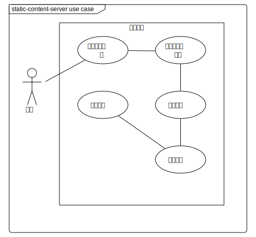
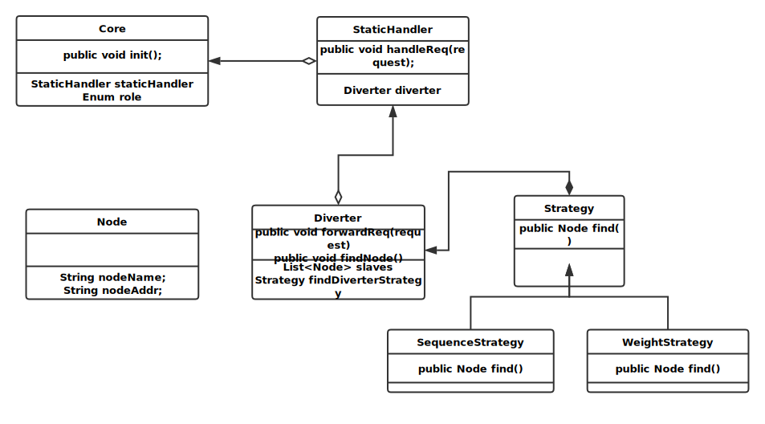
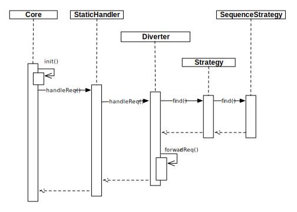

# Demo 模块 #

## 一、概述 ##
### 承担的需求（主要秘密） ###

1. 负责静态内容如js,css,html,img等资源的维护和分发
2. 负责根据一定策略来将当前服务器收到的资源请求分发到其他的服务器上，以降低负载

### 用例图设计 ###

### 可能会修改的实现（次要秘密） ###

1. 可能会更改Node数据结构的内容
2. 可能会增加新的节点查找策略

### 角色 ###

Gateway: 所有外部请求需要统一由网关处理和转发，静态资源也从网关转发

## 二、类的设计 ##

### 2.1 类图 ###

### 2.2 类描述 ###
#### Core 类 ####

|              类方法               |              描述              |
| :---------------------------- | :-------------------------- |
| public void init() | 初始化静态资源服务器环境 **前置条件**:无 **后置条件:**无 |

#### StaticHandler 类 ####

|              类方法               |              描述              |
| :---------------------------- | :-------------------------- |
| public void handleReq(String url) | 根据传入的url来处理返回的资源 **前置条件**:无 **后置条件:**无 |

#### Diverter 类 ####

|              类方法               |              描述              |
| :---------------------------- | :-------------------------- |
| public void forwardReq(request) | 将请求转发到其他的节点中 **前置条件**:无 **后置条件:**无 |

#### Strategy 类 ####

|              类方法               |              描述              |
| :---------------------------- | :-------------------------- |
| public void find() | 查找最合适转发的节点 **前置条件**:无 **后置条件:**无 |

#### SequenceStrategy类 ####

|              类方法               |              描述              |
| :---------------------------- | :-------------------------- |
| public void find()| 在空闲列表中顺序查找合适转发的节点 **前置条件**:无 **后置条件:**无 |

#### WeightStrategy类 ####

|              类方法               |              描述              |
| :---------------------------- | :-------------------------- |
| public void find()| 在空闲列表中按照权重策略来查找合适转发的节点 **前置条件**:无 **后置条件:**无 |

#### Node 类 ####

记录节点的元数据的数据结构

## 三、重要协作 ##
### 顺序图 ###

## 四、设计模式应用 ##

### 策略模式 ###

使用策略模式来维护节点查找策略，可以保证在不同的情况下切换到不同的策略