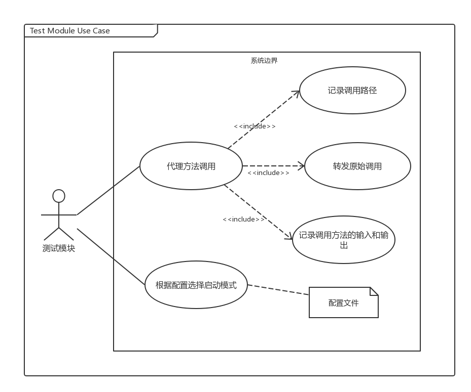
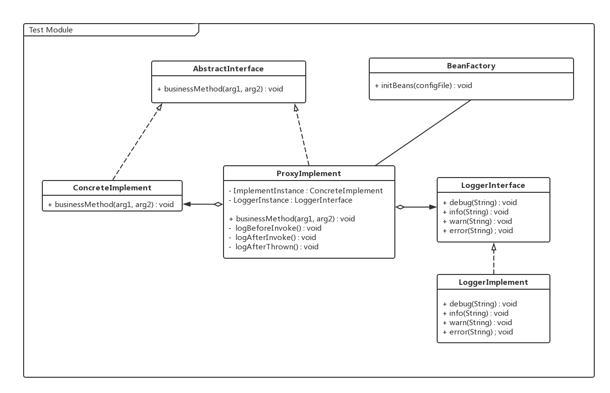
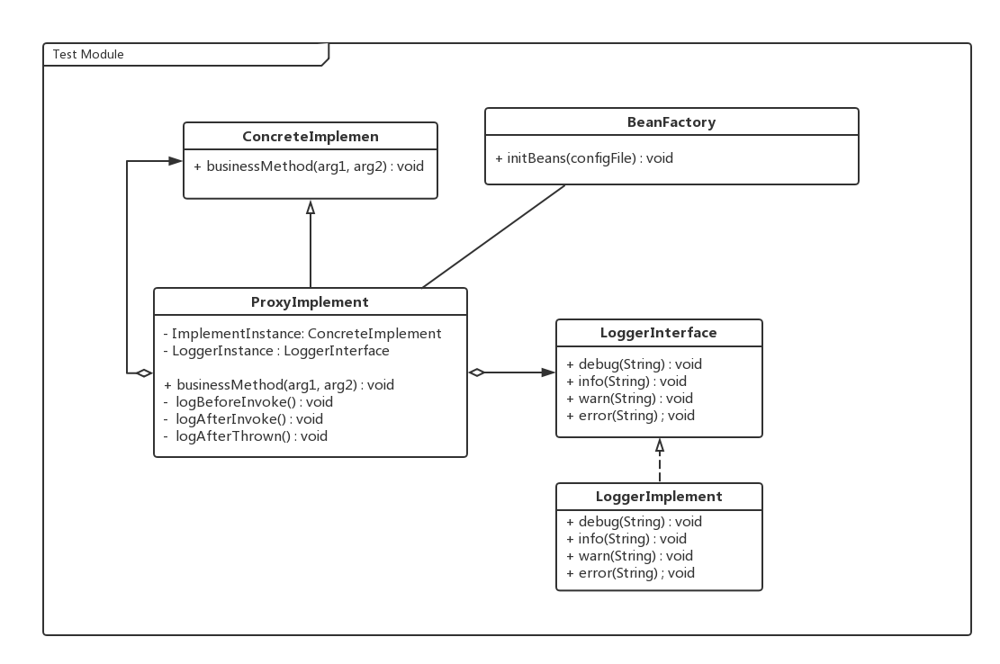
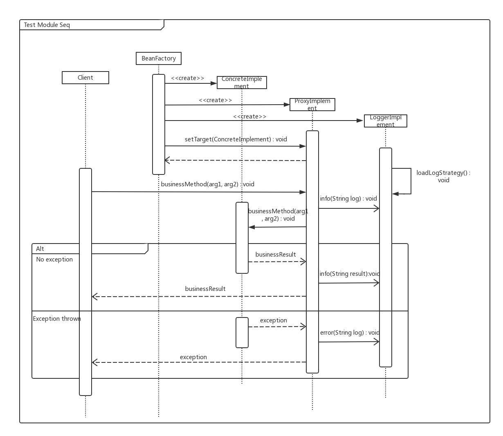
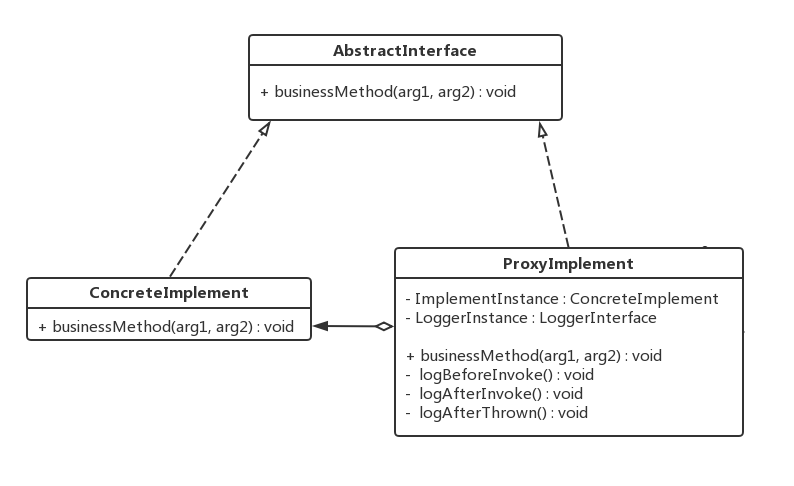
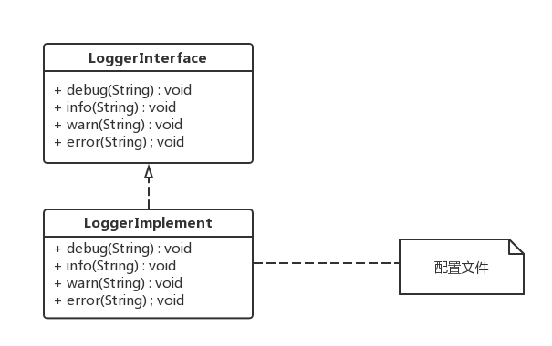
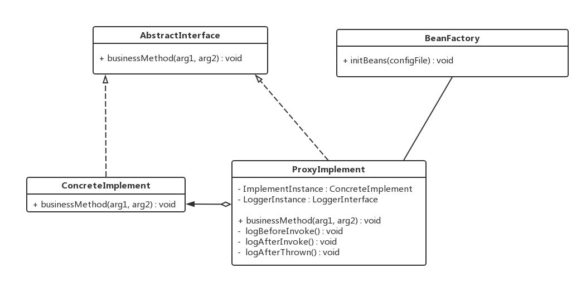

# 测试模块
## 一、概述
### 1.1 承担的需求（主要秘密）
测试模块负责将系统在运行时所有调用路径和每次调用的开始时间、结束时间、输入和输出数据通过日志记录下来，用于系统运行状态的分析和错误调试。测试模式的启用与停用是通过配置文件指定的，且只有在测试模式下关于测试的逻辑代码才会被加载，而在系统通过正常摸试启动时，测试模块的组件应该不会被载入到内存中，以减少内存资源和计算资源你的占用。

### 1.2 质量属性要求
- 测试模块的集成应该保证系统的内聚性不被破坏，即正常的系统逻辑代码中不应该掺杂着测试模块的逻辑代码，保证测试模块和系统功能性模块是松耦合的。
- 测试模块本身应该具有可扩展性和可修改性，测试模式下需要记录的内容和记录方式都应该易于修改、添加或删除。

### 1.3 设计概述
1. 测试模块从配置文件读取配置，如果要求进入测试模式，则实例化测试模块需要的组件，否则正常启动系统。
2. 测试模式下，通过工厂为每个类生成代理类，并用对代理类的方法调用代替对原始目标对象的方法调用，而系统组件则透明的调用代理类的方法，并不能察觉到发生的改变。
3. 代理类先记录下方法调用发生的时间、路径等信息，再将调用转发给实际的目标对象，在目标对象方法返回时，记录参数和返回结果，最后将结果返回给调用者，完成一次完整的调用流程。

### 1.4 用例图
  

### 1.5 用例描述
1. 代理方法调用主要职责是将原始的方法调用通过代理技术“包裹”起来，使得对系统内部原来直接的方法调用变成间接调用，并由测试模块进行预处理（记录调用路径）、转发和调用后处理（记录返回值）。
2. 记录调用路径用例的职责是在被调用者被调用前，截获调用请求，记录下调用发生的时间、来源、被调用方法名称等信息。
3. 转发原始调用的职责是将被代理对象记录后的请求转发给真正的调用接受方，然后将调用结果进行接下来的处理或直接返回调用者。
4. 记录调用方法的输入和输出用例的职责是在返回调用者前将调用方法的返回结果记录下来，然后再返回。
5. 根据配置选择启动模式用例的职责是在系统启动时读取配置文件，根据其中关于测试模式的配置内容决定是否加载测试模块组件进入主存运行。

### 1.6 可能会修改的实现（次要秘密）
1. 日志记录格式和内容
2. 配置文件格式和内容

### 1.7 角色
1. 条件创建实例：  
根据配置内容，动态决定是否为系统内部的对象生成代理对象，如果配置文件决定系统进入正常模式而不是测试模式，注意此时不是让代理对象关闭日志记录，而是直接**不生成代理对象**。
2. 代理转发请求：  
测试模块拦截方法调用请求，在请求的生命周期中添加上额外的处理逻辑（记录日志），在不修改核心业务逻辑模块代码的基础上增加了新的功能。

### 1.8 对外接口
测试模块不提供对外接口。

## 二、类的设计
### 2.1 类图
根据被代理类是实现了其他的抽象接口还是没有实现接口，测试模块采取两种不同的处理办法，分别如下：  
- 被代理对象实现了抽象接口：  

- 被代理类没有实现抽象接口：  

### 2.2 类描述
上图中两种情况下的实现逻辑大部分还是相同的，区别在于对于没有接口继承时，代理类直接将继承自目标类（需要被代理的类），再在自身内部递归的包含目标类。无论采取哪一种方式，它们最终达成的效果都是相同的。

#### 2.2.1 AbstractInterface接口
该接口泛指系统中一般的那些需要被记录调用日志的业务逻辑接口，这里仅表示其存在，业务逻辑具体有哪些取决于系统的具体实现。

**类方法：**

| 类方法 | 描述     |
| :-------------: | :-------------: |
| public void businessMethod(arg1, arg2) | 泛指所有的需要被记录调用日志的方法 |

**数据结构：**

取决于具体业务类的实现。

#### 2.2.2 ConcreteImplement类
AbstractInterface的实现类，这里仅表示其存在，业务逻辑具体有哪些取决于系统的具体实现。

**类方法**

同上文`AbstractInterface`接口。

**数据结构：**

取决于具体业务方法的实现。

#### 2.2.3 ProxyImplement类
泛指所有代理对象，负责代理所有对目标对象的方法调用，并对调用过程添加日志记录逻辑。该类和被代理的目标类要么实现同一个接口要么继承自目标类，因此系统中其他部分对它们的调用是透明的。在系统运行时，如果进入代理模式，系统中其他部分在调用目标类的方法时，其实调用的是代理类的方法，而代理类会将调用转发给目标类，因此调用者并不知道，也不会收到影响。

**类方法**

| 类方法 | 描述 |
| :------------- | :------------- |
| public void businessMethod(arg1, arg2) | 代理对目标对象同名方法调用的方法 前置条件：代理类已配置完成 后置条件：记录调用日志、转发调用给目标对象、记录调用结果 |
| public void logBeforeInvoke() | 记录调用发生的时间、调用方法名称 前置条件：代理类已拦截对目标对象的方法调用 后置条件：记录调用日志，转发调用至真实方法 |
| public void logAfterInvoke() | 记录方法调用参数和返回结果 前置条件：对真实方法的调用已经返回 后置条件：记录返回结果和参数 |
| public void logAfterThrown() | 记录异常发生时的异常具体信息，用于时候针诊断 前置条件：代理类配置已完成 后置条件：记录异常发生时的错误栈 |

**数据结构**

| 数据结构 | 描述 |
| :------------- | :------------- |
| ConcreteImplement realInstance | 代理类所代理的实际的目标对象，真实业务逻辑的实现需要转发至此类 |
| LoggerInterface logerInstance | 负责日志记录具体操作的接口，其记录时的具体格式可配置 |

#### 2.2.4 LoggerInterface接口
日志记录操作的抽象接口，定义了常用的日志记录操作，其具体实现取决于实现类的配置。其主要方法为四个级别的日志记录方式，重要级别debug < info < warn < error，记录日志时可以选择适合的级别进行记录。

**类方法**

| 类方法 | 描述 |
| :------------- | :------------- |
| public void debug(String) | 采用debug级别的日志记录 |
| public void info(String) | 采用info级别的日志记录 |
| public void warn(String) | 采用warn级别的日志记录 |
| public void error(String) | 采用error级别的日志记录 |

**数据结构**

无重要数据结构。

#### 2.2.5 LoggerImplement类
日志记录操作的实现类，其可根据配置文件的内容自定义日志记录格式等具体记录细节。该类是单例，即只有一个对象实例，这样可以保证记录日志时不会因为多个类对同一份日志文件的并行写入而产生错误。

**类方法**

同上文中`LoggerInterface`接口。

**数据结构**

同上文中`LoggerInterface`接口。

#### 2.2.6 BeanFactory类
测试模块创建代理类实例的工厂，根据需要为不同的目标类动态产生其代理类并实例化。是否创建代理类需要根据配置文件内容来确定，当配置文件中关闭测试模式时，代理类应该不会动态生成。

**类方法**

| 类方法 | 描述 |
| :------------- | :------------- |
| public void initBeans(configFile) | 根据配置内容按需创建系统所需要的代理类 |

**数据结构**

无重要数据结构。

## 三、重要协作
### 3.1 顺序图

## 四、设计模式应用
### 4.1 单例模式
测试模块的日志记录组件需要从磁盘配置文件中载入日志记录格式，系统在记录日志时需要保证日志格式的统一性，而且多个日志记录类的实例容易导致记录时发生冲突，因此日志记录组件必须只有一个实例。并且使用单例模式只需要载入一次配置内容，减少磁盘配置文件读取次数，减少冗余的IO操作进而减少性能损耗。

### 4.2 代理模式
系统需要在进入测试模式时能够在不破坏原有业务逻辑的基础上增加新的日志记录功能，而代理模式正好可以达到这个要求。  
代理模式通过为每个业务逻辑类添加新的代理，从而让client实际上拿到的引用并不是真正的目标对象，而只是一个假的proxy。这样client在调用业务方法时，系统就可以插入日志记录的增强过程，通过调用的转发让client的调用请求也得以正常的执行。

代理模式在类图中的体现如下：  
  

上图中代理类ProxyImplement通过和原来的被代理类ConcreteImplement实现同一个Interface，其内部持有真正的目标类ConcreteImplement的引用，并会在client调用时进行转发，于是client可以透明的调用自己持有的代理类的方法也能正常完成任务。  
通过使用代理模式，保证了业务部分的内聚性，也增强了系统的可扩展性，使得有限的修改和功能增强不会影响系统其他部分。

### 4.3 策略模式
策略模式能够将系统在局部上一些实现细节的不确定性封装起来，易于在将来甚至是运行时的修改。在本实验中，日志记录类的日志记录格式是不确定的，可能需要记录每次调用发生的时间，可能需要记录调用参数，也可能不需要。而且记录格式的需求将来也可能会随着时间的推移而发生变化，因此此处最佳的方法就是使用策略模式将记录格式封装起来。  
在爱比价系统中，我们将日志记录的格式封装到了日志组件的配置文件中，系统在启动时会从配置文件读取日志记录格式信息。配置文件通过使用特定类似正则表达式的表示方法，可以在不修改系统代码的情况下记录不同格式的日志，满足客户的不同需求。

策略模式在类图中的体现如下图：  
  

### 4.4 工厂模式
工厂模式一般用来统一管理对象的创建过程，减少系统不同部分之间在创建对象时的复杂度和耦合度。在测试模块中，有大量的代理类对象需要被创建，而且系统不可能为每个业务类都创建一个代理类，哪些类需要创建代理是通过**类全名**的正则表达式来指定的，对象创建工厂根据匹配的类名来为需要的类创建代理类，并初始化其引用关系。

工厂模式在类图中的体现如下：  

通过工厂模式的使用，将复杂的对象创建过程从业务逻辑中抽出来，分解了复杂度，提高了程序的内聚性，让业务模块只负责自身的核心逻辑。同样，独立出来的对象创建部分也更加容易管理。
