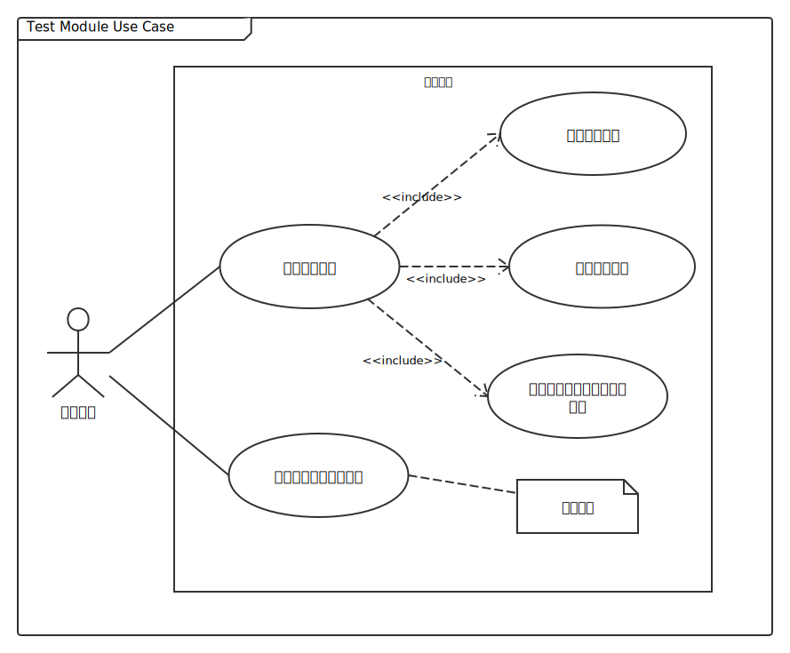
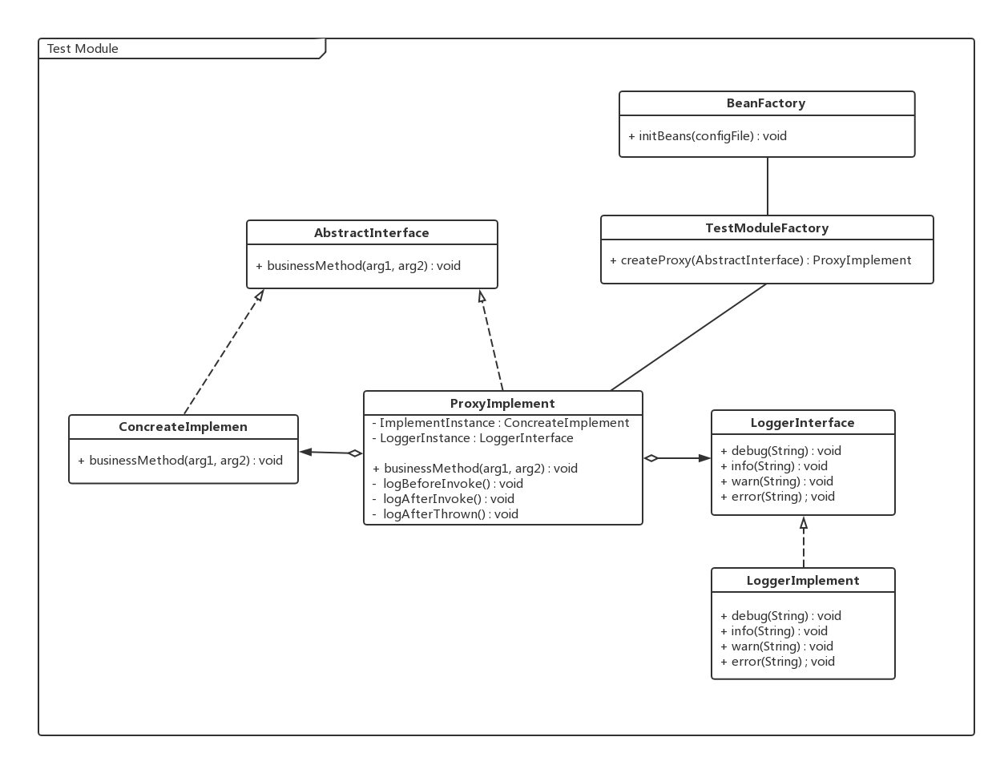
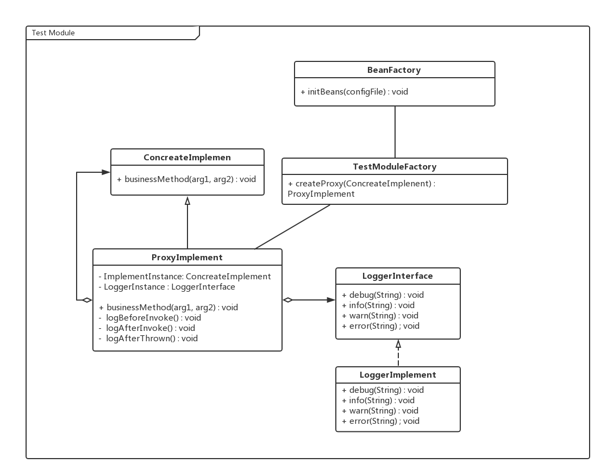

# 概述
## 承担的需求（主要秘密）
测试模块负责将系统在运行时所有调用路径和每次调用的开始时间、结束时间、输入和输出数据通过日志记录下来，用于系统运行状态的分析和错误调试。测试模式的启用与停用是通过配置文件指定的，且只有在测试模式下关于测试的逻辑代码才会被加载，而在系统通过正常摸试启动时，测试模块的组件应该不会被载入到内存中，以减少内存资源和计算资源你的占用。

### 质量属性要求
测试模块的集成应该保证系统的内聚性不被破坏，即正常的系统逻辑代码中不应该掺杂着测试模块的逻辑代码，保证测试模块和系统功能性模块是松耦合的。而且测试模块本身应该具有可扩展性和可修改性，测试模式下需要记录的内容和记录方式都应该易于修改、添加或删除。

### 用例图
  

### 用例描述
1. 代理方法调用主要职责是将原始的方法调用通过代理技术“包裹”起来，使得对系统内部原来直接的方法调用变成间接调用，并由测试模块进行预处理（记录调用路径）、转发和调用后处理（记录返回值）。
2. 记录调用路径用例的职责是在被调用者被调用前，截获调用请求，记录下调用发生的时间、来源、被调用方法名称等信息。
3. 转发原始调用的职责是将被代理对象记录后的请求转发给真正的调用接受方，然后将调用结果进行接下来的处理或直接返回调用者。
4. 记录调用方法的输入和输出用例的职责是在返回调用者前将调用方法的返回结果记录下来，然后再返回。
5. 根据配置选择启动模式用例的职责是在系统启动时读取配置文件，根据其中关于测试模式的配置内容决定是否加载测试模块组件进入主存运行。

### 可能会修改的实现（次要秘密）
1. 日志记录格式和内容
2. 配置文件格式和内容

### 角色
1. 条件创建实例：  
根据配置内容，动态决定是否为系统内部的对象生成代理对象，如果配置文件决定系统进入正常模式而不是测试模式，注意此时不是让代理对象关闭日志记录，而是直接**不生成代理对象**。
2. 代理转发请求：  
测试模块拦截方法调用请求，在请求的生命周期中添加上额外的处理逻辑（记录日志），在不修改核心业务逻辑模块代码的基础上增加了新的功能。

### 对外接口
测试模块不提供对外接口。

### 类图
根据被代理类是实现了其他的抽象接口还是没有实现接口，测试模块采取两种不同的处理办法，分别如下：  
- 被代理对象实现了抽象接口：  

- 被代理类没有实现抽象接口：  

### 类描述
上图中两种情况下的实现逻辑大部分还是相同的，区别在于对于没有接口继承时，代理类直接将继承自目标类（需要被代理的类），再在自身内部递归的包含目标类。

#### 1. AbstractInterface接口
该接口泛指系统中一般的那些需要被记录调用日志的业务逻辑，这里仅表示其存在，业务逻辑具体有哪些取决于系统的具体实现。

**类方法：**

| 类方法 | 描述     |
| :-------------: | :-------------: |
| public void businessMethod(arg1, arg2) | 泛指所有的需要被记录调用日志的方法 |

**数据结构：**

取决于具体业务方法的实现。

#### 2. ConcreateImplement类
AbstractInterface的实现类，这里仅表示其存在，业务逻辑具体有哪些取决于系统的具体实现。

**类方法**

同上文`AbstractInterface`接口。

**数据结构：**

取决于具体业务方法的实现。

#### 3. ProxyImplement类
核心代理对象，负责代理所有对目标对象的方法调用，并对调用过程添加日志记录逻辑的实现类。

**类方法**

| 类方法 | 描述 |
| :------------- | :------------- |
| public void businessMethod(arg1, arg2) | 代理对目标对象同名方法调用的方法 前置条件：代理类已配置完成 后置条件：记录调用日志、转发调用给目标对象、记录调用结果 |
| public void logBeforeInvoke() | 记录调用发生的时间、调用方法名称 前置条件：代理类已拦截对目标对象的方法调用 后置条件：记录调用日志，转发调用至真实方法 |
| public void logAfterInvoke() | 记录方法调用参数和返回结果 前置条件：对真实方法的调用已经返回 后置条件：记录返回结果和参数 |
| public void logAfterThrown() | 记录异常发生时的异常具体信息，用于时候针诊断 前置条件：代理类配置已完成 后置条件：记录异常发生时的错误栈，再抛出异常 |

**数据结构**

| 数据结构 | 描述 |
| :------------- | :------------- |
| ConcreateImplement realInstance | 代理类所代理的实际的目标对象，真实业务逻辑的实现需要转发至此类 |
| LoggerInterface logerInstance | 负责日志记录具体操作的接口，其记录时的具体格式可配置 |

#### 4. LoggerInterface接口
日志记录操作的抽象接口，定义了常用的日志记录操作，其具体实现取决于子类的配置。

**类方法**

| 类方法 | 描述 |
| :------------- | :------------- |
| public void debug(String) | 采用debug级别的日志记录 |
| public void info(String) | 采用info级别的日志记录 |
| public void warn(String) | 采用warn级别的日志记录 |
| public void error(String) | 采用error级别的日志记录 |

**数据结构**

无重要数据结构。

#### 5. LoggerImplement类
日志记录操作的实现类，其可根据配置自定义日志记录格式等具体记录细节。

**类方法**

同上文中`LoggerInterface`接口。

**数据结构**

同上文中`LoggerInterface`接口。

#### 6. TestModuleFactory类
创建代理对象的工厂类，负责产生所有代理对象并进行初始化装配，它是系统能进入测试模式的基础。其本身的实例化需要由`BeanFactory`根据配置文件的内容来确定。

**类方法**

| 类方法 | 描述 |
| :------------- | :------------- |
| public ProxyImplement createProxy(ConcreateImplement) | 根据不同类型的目标对象自动创建不同的代理对象 前置条件：无 后置条件：将对原目标对象的调用引用替换为对新的代理对象的调用引用 |

**数据结构**

无重要数据结构。

#### 7. BeanFactory类
全局创建bean的工厂，负责根据配置要求实例化系统各部分组件。

**类方法**

| 类方法 | 描述 |
| :------------- | :------------- |
| public void initBeans(configFile) | 根据配置内容按需创建系统所需要的bean |

**数据结构**

无重要数据结构。

### 重要协作
#### 1. 顺序图

### 使用到的设计模式
> 工厂模式（动态创建bean+spring aop生成代理）,proxy模式，
