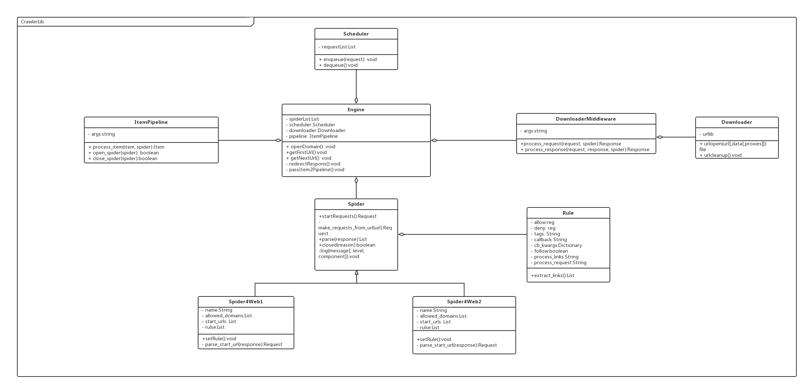

#CrawlerLib模块
## 一、概述 ##

### 承担的需求（主要秘密） ###
  该模块承担的主要任务是从电商网站上爬取商品信息，选择爬取策略。
  
  该模块需要实现自动爬取指定网页的功能，然后分析爬取内容，将需要的商品信息交给数据处理模块处理、存储。
  
### 可能会修改的实现(次要秘密) ###
* 该模块需要兼容不同的电商网站，对不同的网站采取不同的网页爬取方式。

* 该模块需要实现爬取策略可变更的功能，以后会增加新的电商网站和新的商品种类，所以需要增加新的网页爬取方式，此时应该面向扩展开放，面向修改关闭。

* 定期进行爬取的控制（调用）方式可能会改变。

* 和数据处理模块的接口可能会改变，如果数据库的组织形式发生改变，则返回的数据格式也需要变化。

### 设计的相关质量属性 ###
* R3 电商网站兼容性

### 设计概述 ###
其需要考虑的核心问题为：爬虫数据的爬取无非就是数据流的转换和处理。数据流控制过程如下：  

1.引擎打开一个网站，找到处理该网站的Spider并向该spider请求第一个要爬取的URL(s)。  

2.引擎从Spider中获取到第一个要爬取的URL并在调度器中以Request调度。  

3.引擎向调度器请求下一个要爬取的URL。  

4.调度器返回下一个要爬取的URL给引擎，引擎将URL通过下载中间件(请求(request)方向)转发给下载器。  

5.一旦页面下载完毕，下载器生成一个该页面的Response，并将其通过下载中间件(返回(response)方向)发送给引擎。  

6.引擎从下载器中接收到Response并通过Spider中间件(输入方向)发送给Spider处理。  

7.Spider处理Response并返回爬取到的Item及(跟进的)新的Request给引擎。  

8.引擎将(Spider返回的)爬取到的Item给Item Pipeline，将(Spider返回的)Request给调度器。  

9.(从第二步)重复直到调度器中没有更多的request，引擎关闭该网站。  

另外需要兼容不同的电商网站后变得容易扩展。设计中不同的网站有不同的Spider，所以将爬到的数据转换成统一的Item数据格式即可满足兼容不同的电商网站。


### 角色 ###
在整个系统中扮演商品数据信息获取的角色，并将提取的商品信息传递给数据处理模块。


### 对外接口 ###
```java
JSONArray getData();
```
数据格式定义为：
```json
"url":网页连接
"source":来源
"name":商品名称
"price":价格
"picture_url":图片连接
"shop":店铺
```

## 类图 ##



## 类描述 ##

类方法（重要方法要给出前置与后置条件）与重要数据结构描述
# 重要协作 #

顺序图与协作描述


# 使用的设计模式 #


