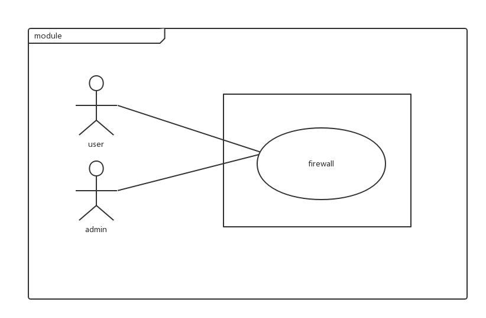
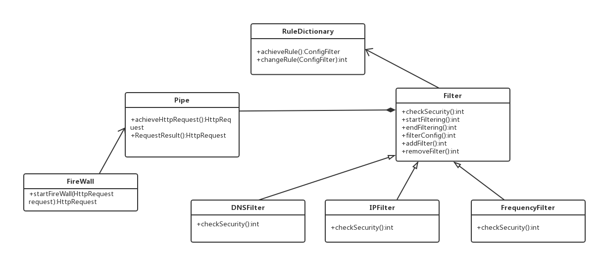
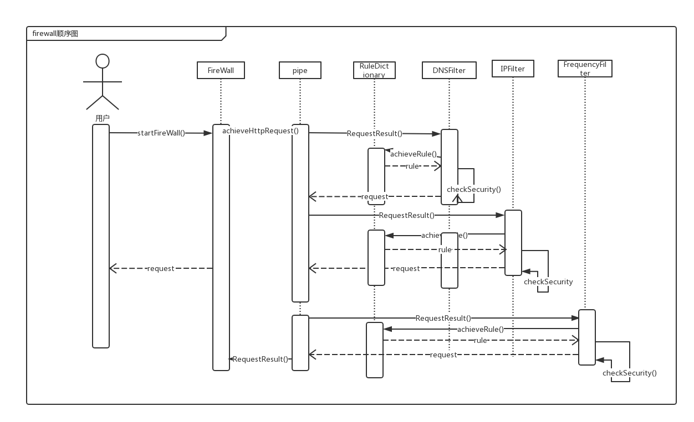
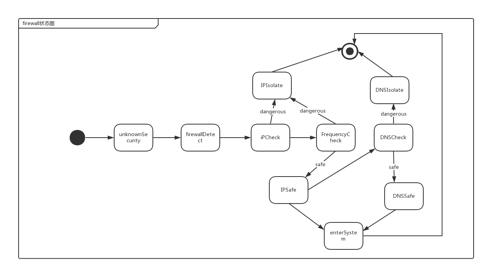

# Firewall 模块 #

## 一、概述 ##
### 承担的需求（主要秘密） ###
模块需求：该模块负责保证服务器安全。用户访问服务器时需要先通过服务器检测模块， 屏蔽特定 IP 以及访问过于频繁的 IP（插件扫描攻击）。并且该模块支持可能的入侵检测 规则扩展。 

**涉及需求**：

**R11 入侵检测**

C21: 若用户一分钟内访问频度超过200次,视为攻击并屏蔽 阻碍R10

C22: 添加新的入侵检测规则能在1人/月内完成

**R12 屏蔽特定IP**

C23: 系统可以屏蔽特定IP的访问 促进R10

C24: 允许运行时添加屏蔽IP

### 用例图设计 ###

### 可能会修改的实现（次要秘密） ###
所屏蔽的特定 IP 的列表 
规则库的访问控制规则
系统安全检测方法 (不安全 IP 的检测方法 有威胁的访问频率的检测方法 不安全的DNS的检测方法)

### 角色 ###
该模块从规则库（存放在注册表中）中读取访问控制规则分析发出请求用户的 IP 以及短时间内同一IP的访问频率，将存在威胁的请求(不安全 IP 、有威胁的访问频率、不安全的DNS)进行隔离,最后通过事先制定好的访问规则检查认证确定连接是否允许通过
## 二、类的设计 ##
对外接口： 
 接口：HttpRequest startFireWall(HttpRequest request） () 
 功能：当用户的请求到达系统时，首先调用该接口，该接口将返回对该 IP 访问的检查结果.过滤 IP 有威胁的请求；之后再检查对应 IP 发出请求的频率，进行第二次过滤，再对DNS进行第三次过滤，过滤完后返回过滤结果
 
参数说明： 
HttpRequest request：是用户请求信息，含有用户代理信息以及用户 的请求参数，含有用户的 IP、访问时间、mac 地址、访问目标等 
 
返回值说明：返回是否成功屏蔽。返回值为非null的HttpRequest为过滤后的用户请求，返回值为null则代表该用户被屏蔽。

使用方法： 
每当一个用户使用系统的时候，服务器请求数据，系统自动调用该模块，并且对请求做过滤检查来查看用户是否符合访问安全要求
 
前置条件： 
应用服务器传来 Http 请求，传入的 request 中包含用户 IP、mac 地址、访问时间、访问目标 
 
后置条件：
1、安全检测通过，用户可以访问系统，返回内容为HttpRequest，该HttpRequest中所含的请求参数列表被传入下一个模块的接口
2、安全检测不通过，用户发出http请求因为被系统判定为不安全而被屏蔽，用户将无法访问系统，请求被抛弃  

设计方案分析：
当用户的请求到达系统时，用户发出的HttpRequest通过两个过滤器进行过滤， 如果输出结果依然是HttpRequest的话则表明通过安全性检测，如果结果输出 null 则此次 Http请求被忽略。模块设计为管道过滤器模式，过滤的策略（IP 安全性检测策略、同一IP访问频率检测策略、DNS安全性检测策略）可以灵活变动而不影响总体的结构。 
Filter提供所有网络数据的过滤操作。pipe通过RuleDictionary获取屏蔽策略传递网络数据到Filter进行处理。如果一个过滤层的Filter条件被满足，过滤器对HttpRequest数据包做出相应改动（屏蔽的话改为null）

### 2.1 类图 ###

设计说明：
该模块主要由这几个部分组成：FireWall,Pipe,RuleDictionary 和 Filter. IPFilter ,DNSFilter和 FrequencyFilter 继承Filter抽象类。RuleDictionary定义屏蔽规则，由Filter使用，如定义1秒内访问次数多于3次的IP视为Frequency屏蔽对象，规则设定可由changeRule()修改，提供开放性修改规则。HttpRequest通过Pipe在Filter之间传递，经过 IPFilter和FrequencyFilter的checkSecurity（）方法过滤后，请求进入下一个模块。由此确保通过过滤后的用户请求不在规则所指定屏蔽范围内。
### 2.2 类描述 ###
#### FireWall类 ####
防火墙请求者，传递HttpRequest希望启用防火墙服务
#### Pipe类 ####
管道类，用来在 filter 之间传递 HttpRequest 对象 
#### RuleDictionary类 ####
定义过滤条件，让filter根据其条件进行过滤，有修改方法可供系统维护者修改条件。
#### filter类 ####
过滤器抽象类，定义了检查安全性的抽象性方法及启动和关闭过滤器的方法，checkSecurity()方法由子类具体实现。 
#### IPFilter类 ####
Filter的子类，负责根据对HttpRequest中的IP进行检测，当IP符合定义的规则将request传给FrequencyFilter，否则直接返回null，屏蔽用户访问请求 
#### DNSFilter类 ####
Filter的子类，负责根据对HttpRequest中的DNS进行检测，当DNS符合定义的规则将request传给FrequencyFilter，否则直接返回null，屏蔽用户访问请求
#### FrequencyFilter类 ####
Filter的子类，对request对象所对应的IP所发出的请求频率（一秒钟请求多少次）进行检查，若高于所规定频率则判断为非人类操作行为，直接返回null，不返回HttpRequest，屏蔽用户访问请求。

|FireWall中方法 | 功能 |
| :--- | :--- |
|startFireWall |从用户发送HttpRequest开始请求调用防火墙进行过滤，传递request给pipe|

| RuleDictionary中方法 | 功能 |
| :--- | :--- | 
|achieveRule| 获取定义的屏蔽规则 |
|changeRule| 改变屏蔽规则 |

| Pipe中方法 | 功能 |
| :--- | :--- |
|achieveHttpRequest | 获取进入管道的 HttpRequest 对象 | 
|RequestResult |向过滤器传入 HttpRequest 对象 |
 
| Filter中方法 | 功能 |
| :--- | :--- | 
|startFiltering| 启动过滤器 |
|endFiltering| 关闭过滤器 |
|checkSecurity| 根据过滤规则进行过滤|
|filterConfig| 根据规则进行过滤器配置|
|addFilter| 增加一个过滤器|
|removeFilter| 删除一个过滤器|
 
| IPFilter中方法 | 功能 |
| :--- | :--- |  
|checkSecurity |根据IP过滤规则检查IP是否是被指定屏蔽的，如果是则返回null，不是则返回HttpRequest给管道传递给下一个过滤器 |
 

| FrequencyFilter中方法 | 功能 |
| :--- | :--- |  
|checkSecurity| 根据同一个IP访问频率规则检查 该用户是否为人类行为，如果不是则返回null，是则返回HttpRequest给管道传递给下一个过滤器 | 

| DNSFilter中方法 | 功能 |
| :--- | :--- | 
|checkSecurity| 根据DNS过滤规则检查 DNS 是否是被指定屏蔽的，如果是则返回null，不是则返回HttpRequest给管道传递给下一个过滤器 |

重要的数据结构描述 
| 数据结构 | 描述 |
| :--- | :--- |
|用户请求 HttpRequest|其中有用户信息，请求参数，用户代理信息 |
|规则配置 ConfigFilter|其中有过滤器过滤规则参数 |

## 三、重要协作 ##
### 顺序图 ###

### 状态图 ###

## 四、设计模式应用 ##

### pipe-filter风格 ###

  firewall模块使用了pipe-filter设计模式。模块含有三个具体的过滤器：IP过滤、DNS过滤、高频检测过滤。分别从管道获取Http请求然后对于过滤对象进行检测。具体步骤为先对IP进行检测，如果发现是需要屏蔽的IP，则返回null，隔离访问，如果发现不是要屏蔽的IP，则将HttpRequest返回至管道，再进行特定DNS检测，同样的方法再进行对IP访问频率的检测。按照《POSA(面向模式的软件架构)》里的说法，管道过滤器（Pipe-And-Filter）应该属于架构模式，因为它通常决定了一个系统的基本架构。管道过滤器和生产流水线类似，在生产流水线上，原材料在流水线上经一道一道的工序，最后形成某种有用的产品。在管道过滤器中，数据经过一个一个的过滤器，最后得到需要的数据。这对防火墙设计来说是高效且安全的，因为如果一个被设定为屏蔽的IP访问，在第一道过滤器就被隔离了，不会进行下面的过滤器检测，提高了时间效率。且pipe-filter将数据流传递与过滤操作分离，提高安全性。
  
### 策略设计模式 

策略模式是对算法的封装，它把算法的责任和算法本身分割开，委派给不同的对象管理。策略模式通常把一个系列的算法封装到一系列的策略类里面，作为一个抽象策略类的子类。在firewall中，将filter抽象出来，过滤算法由每个具体的filter实现，是一种策略设计模式。使用策略设计模式有易修改性、高复用性等优势。

